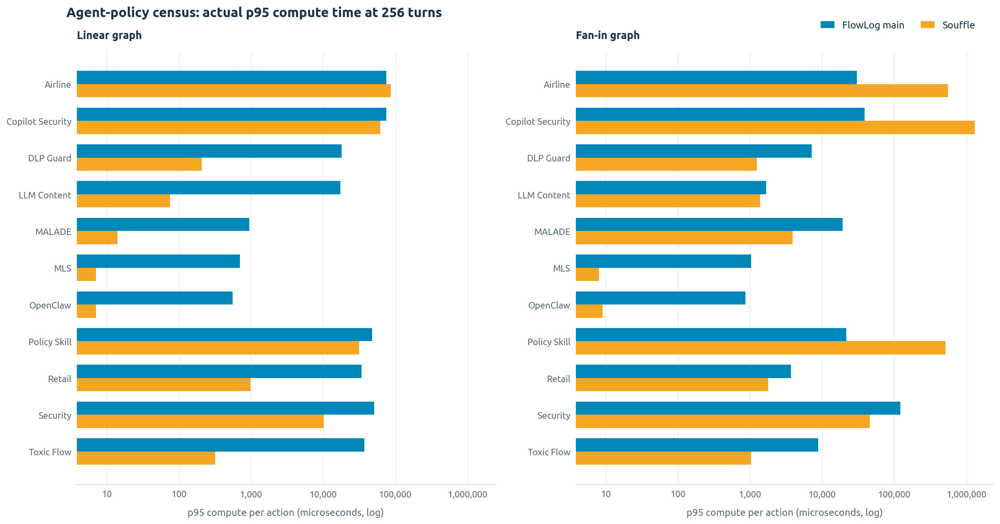
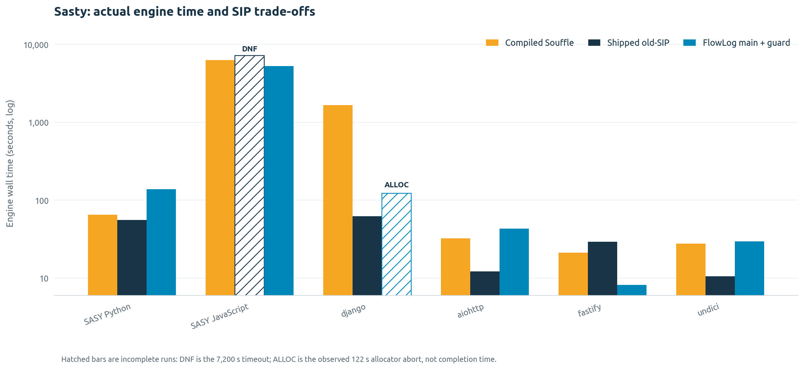
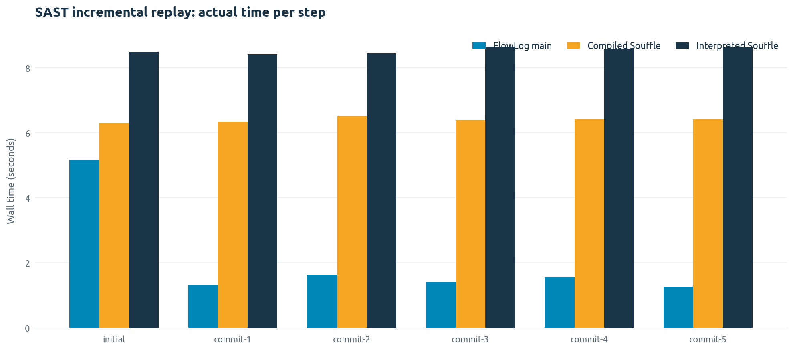

# FlowLog vs Souffle on SASY and Sasty

September 24, 2026 | single-threaded | AMD EPYC 7763 | 503 GiB RAM

This campaign compares three FlowLog releases with Souffle 2.5 across:

- 11 agent-policy workloads;
- bounded linear and fan-in graph ladders;
- a guard-policy ablation;
- Sasty's 851-rule static taint analysis on 18 public repositories;
- Sasty scans of the SASY source tree; and
- six real incremental SASY commits.

Speedup always means **Souffle time / FlowLog time**. Values above 1 favor
FlowLog.

## Key findings

1. **FlowLog is strongest when it avoids expensive recomputation.**
   Steady-state SAST updates are 4.0x to 5.1x faster than compiled Souffle.
   High-fan-in agent policies reach 18x to 34x speedups.

2. **Souffle remains much faster on many small policy workloads.**
   Latest FlowLog wins 4 of 22 cells in the 256-turn census and 10 of 77
   in-budget ladder cells.

3. **Recent common-subexpression work helps fan-in more than linear graphs.**
   Latest FlowLog is 1.20x faster than the old release across the census.
   The gain rises from 1.10x at fan-in 32 to 1.32x at fan-in 128, while
   linear shapes remain near 1.03x.

4. **Removing SIP is a major workload-dependent trade-off.**
   Latest FlowLog no longer has sideways information passing. Without SIP,
   many small corpora and the large JavaScript case improve, but Python-off,
   aiohttp, undici, and especially django regress sharply.

5. **One-shot SAST is competitive in time but expensive in memory.**
   On completed cases, latest FlowLog is 1.94x faster than interpreted
   Souffle and 1.09x faster than compiled Souffle. It often uses several
   times more memory, and the completed-case geometric means exclude
   timeouts and allocation failures.

6. **The latest FlowLog result required a local planner guard.**
   Unmodified main crashes while compiling Sasty's policy. The measured
   `newfix` build is FlowLog `07ffd67` plus a one-map fusion guard. The
   CSE commits are not the cause of the crash.

## Result map

| Family | Main result | Important qualification |
|---|---:|---|
| Agent-policy census, 256 turns | 4/22 wins, 0.157x geomean | High fan-in wins; most small cells lose |
| Published forward forms | 6/22 wins, 0.320x | Rewriting is shape-dependent |
| In-budget ladders | 10/77 wins, 0.075x | CSE gain grows with fan-in |
| Guard profile | 0.09x to 0.35x | No-gate reaches 1.43x |
| SAST engine-only vs interpreted Souffle | 1.944x, 17/18 wins | Completed cases only |
| SAST engine-only vs compiled Souffle | 1.088x, 10/19 wins | Completed cases only |
| End-to-end SASY Python scan | 0.807x | Shipped old-SIP build reaches 1.493x |
| Incremental SAST commits | 4.0x to 5.1x | Steps 1-5 after initial load |

## FlowLog versions

| Label | Revision | Build/runtime/compiler | SIP |
|---|---|---|---|
| old | `6c111b7` | 0.4.0 / 0.3.0 / 0.5.0 | measured both on and off |
| mid | `fed4211` | 0.5.0 / 0.4.0 / 0.6.0 | measured both on and off |
| newfix | `07ffd67` plus local guard `c8af77a` | 0.6.0 / 0.5.0 / 0.7.0 | removed upstream |

Sasty ships the old FlowLog release with `--sip --str-intern`. Comparing
`old-sip` directly with `newfix` therefore combines release improvements with
SIP removal. The cleaner non-SIP release comparison is:

| Comparison | SAST geomean |
|---|---:|
| old-noSIP / newfix | 1.070x |
| mid-noSIP / newfix | 1.040x |
| old-noSIP / mid-noSIP | 1.029x |
| old-SIP / newfix | 1.339x |

## Agent-policy results

<p align="center">
  
</p>

[Vector version](policy-census-time.svg). The log scale is necessary because
the measured cells span more than five orders of magnitude.

At 256 turns, latest FlowLog wins:

- Airline linear and fan-in;
- Copilot Security fan-in; and
- Policy Skill fan-in.

The largest latest-FlowLog speedups are:

| Workload | Shape | Speedup |
|---|---|---:|
| Copilot Security | fan-in | 33.42x |
| Policy Skill | fan-in | 23.62x |
| Airline | fan-in | 18.38x |
| Airline | linear | 1.16x |

The 18 losing cells range down to 0.004x. These are cases where the fixed
incremental-engine overhead exceeds the cost of a small Souffle rerun.

The full 22-cell release table, raw p95 times, forward-form results, and
cross-release comparisons are in [FULL_RESULTS.md](FULL_RESULTS.md).

## Forward rewriting

The FlowLog-only forward forms are not a universal optimization:

- Toxic Flow linear improves by 7.2x to 55.1x.
- DLP Guard linear improves by 3.5x to 22.7x.
- Retail linear improves by 2.4x to 15.5x.
- Retail fan-in slows to 0.53x to 0.62x.
- LLM Content fan-in slows to 0.87x to 0.91x.

Sasty's taint policy has no forward form, so this rewrite does not affect the
SAST results.

## Sasty engine-only results

<p align="center">
  
</p>

[Vector version](sasty-selected-time.svg). Hatched bars are incomplete runs,
not successful completion times.

Times are median seconds. `DNF` means the run exceeded the 7,200-second limit.
`ALLOC` means the process aborted in the allocator.

| Corpus | Souffle | Souffle-c | old-SIP | old-noSIP | mid-SIP | mid-noSIP | newfix |
|---|---:|---:|---:|---:|---:|---:|---:|
| SASY Python | 102.00 | 64.71 | 55.48 | 141.69 | 55.11 | 139.08 | 137.49 |
| SASY JavaScript | DNF | 6271 | DNF | 5271 | DNF | 5272 | 5245 |
| starlette | 15.15 | 8.61 | 20.90 | 10.82 | 20.93 | 10.55 | 10.92 |
| werkzeug | 8.46 | 5.37 | 4.66 | 6.97 | 4.58 | 6.77 | 6.68 |
| itsdangerous | 1.33 | 0.38 | 1.22 | 0.56 | 1.16 | 0.53 | 0.50 |
| httpx | 4.94 | 3.02 | 3.09 | 2.17 | 3.02 | 2.11 | 2.03 |
| fastapi | 22.99 | 12.96 | 9.47 | 9.55 | 9.35 | 9.42 | 9.23 |
| aiohttp | 43.61 | 32.19 | 12.15 | 44.59 | 12.00 | 43.34 | 43.22 |
| flask | 2.88 | 1.57 | 2.33 | 1.50 | 2.25 | 1.44 | 1.39 |
| django | 2096.92 | 1653.10 | 61.79 | ALLOC | 62.03 | ALLOC | ALLOC |
| requests | 2.41 | 1.14 | 2.41 | 1.33 | 2.36 | 1.28 | 1.23 |
| uvicorn | 4.82 | 3.05 | 2.65 | 4.59 | 2.59 | 4.46 | 4.41 |
| execa | 4.55 | 3.32 | 3.54 | 1.90 | 3.49 | 1.86 | 1.65 |
| body-parser | 1.48 | 0.51 | 1.43 | 0.56 | 1.39 | 0.53 | 0.50 |
| cookie-parser | 1.25 | 0.31 | 1.17 | 0.45 | 1.13 | 0.43 | 0.40 |
| koa | 1.73 | 0.78 | 1.55 | 0.71 | 1.52 | 0.69 | 0.64 |
| fastify | 28.37 | 21.17 | 29.31 | 8.77 | 29.23 | 8.72 | 8.18 |
| axios | 5.92 | 5.10 | 3.22 | 2.88 | 3.18 | 2.80 | 2.67 |
| express | 2.42 | 1.47 | 2.03 | 0.90 | 2.27 | 0.88 | 0.80 |
| undici | 30.88 | 27.53 | 10.49 | 30.81 | 10.36 | 29.99 | 29.65 |
| JavaScript reachable XL | DNF | DNF | not run | not run | not run | not run | DNF |

Every completed execution matched the reference outputs exactly. No completed
FlowLog execution emitted stderr.

Machine-readable table: [sast-engine.csv](sast-engine.csv).

## SIP trade-off

SIP helps most on:

| Corpus | SIP speedup on old FlowLog |
|---|---:|
| aiohttp | 3.67x |
| undici | 2.94x |
| SASY Python | 2.55x |
| django | only SIP finishes safely |

SIP hurts most on fastify, body-parser, cookie-parser, express, and the large
JavaScript scan. Both SIP builds time out on SASY JavaScript, while the no-SIP
builds finish in about 5,270 seconds.

## Incremental SAST

<p align="center">
  
</p>

[Vector version](incremental-sast-time.svg).

The six-commit replay covers 638 Python files and about 1.16 million unique
facts. FlowLog applies inserts and removals; Souffle reruns from scratch.

| Step | Main FlowLog | Souffle | Compiled Souffle | Compiled speedup |
|---|---:|---:|---:|---:|
| Initial load | 5.167 s | 8.49 s | 6.29 s | 1.2x |
| Commit 1 | 1.304 s | 8.42 s | 6.34 s | 4.9x |
| Commit 2 | 1.619 s | 8.44 s | 6.52 s | 4.0x |
| Commit 3 | 1.398 s | 8.65 s | 6.39 s | 4.6x |
| Commit 4 | 1.561 s | 8.59 s | 6.41 s | 4.1x |
| Commit 5 | 1.261 s | 8.64 s | 6.41 s | 5.1x |

Main improves steady-state FlowLog commit time by 1.03x over the old release.

## Memory and allocator finding

FlowLog frequently trades memory for time:

| Corpus | Souffle | Compiled Souffle | old-SIP | newfix |
|---|---:|---:|---:|---:|
| SASY Python | 1.46 GiB | 0.75 GiB | 3.51 GiB | 20.12 GiB |
| SASY JavaScript | >=78.5 GiB | 50.6 GiB | >=158.5 GiB | 124.8 GiB |
| aiohttp | 0.25 GiB | 0.23 GiB | 0.85 GiB | 8.97 GiB |
| django | 1.37 GiB | 1.30 GiB | 2.52 GiB | >=171.9 GiB |
| undici | 0.44 GiB | 0.42 GiB | 0.89 GiB | 6.84 GiB |

The no-SIP django runs expose a mimalloc v3.3.2 arena-growth defect. They abort
near 172 GiB after exhausting `vm.max_map_count`, despite more than 240 GiB of
available RAM. `MIMALLOC_ARENA_RESERVE=1792MiB` prevents mapping exhaustion,
but the evaluator still grows beyond 240 GiB. SIP finishes the same input in
62 seconds at 2.5 GiB.

## End-to-end Sasty scans

| Case | Souffle | old-SIP | newfix |
|---|---:|---:|---:|
| SASY Python, dependencies off | 145.0 s | 97.2 s | 179.7 s |
| SASY JavaScript, dependencies off | timeout | timeout | timeout |
| Python reachable dependencies | rejected before engine | same | same |
| JavaScript reachable dependencies | rejected before engine | same | same |

The reachable scans fail in dependency discovery before either Datalog engine
runs. The JavaScript first-party scan exceeds Sasty's 900-second production
stage bound with every engine.

## Correctness and limitations

- The SAST comparison hashes sorted rows from all seven public relations.
- Every completed result is exact.
- The completed-case SAST geometric means exclude timeouts and aborts.
- Policy traces are generated because real assistant traces are not in the
  benchmark repository.
- Three unavailable public-corpus pins were replaced by same-era public
  commits; the exact substitutions are listed in the appendix.
- Python reachable XL was not measured because capture exceeded 4 GiB of
  dependency facts.
- Only aggregate measurements are published here. Private source, extracted
  facts, generated evaluator binaries, and multi-gigabyte run directories are
  intentionally excluded.
- The latest result is `newfix`, not pristine main: main requires the local
  planner guard, removal of Sasty's `--sip` argument, and a mechanical rename
  of the newly reserved `fn` identifier.

## Full disclosure

[FULL_RESULTS.md](FULL_RESULTS.md) contains:

- all 22 census cells across old, mid, and latest FlowLog;
- bounded ladder results and per-workload forward-rewrite effects;
- guard ablation measurements;
- every Sasty engine-only timing and peak-RSS result;
- parity tables and all incomplete-run bounds;
- end-to-end scan results;
- incremental commit replay results;
- build and compatibility findings; and
- corpus substitutions, blocked cases, and other deviations.

Machine-readable run settings and the publication boundary are recorded in
[metadata.json](metadata.json).

The figures are generated from [policy-census.csv](policy-census.csv),
[sasty-selected.csv](sasty-selected.csv), and
[incremental-sast.csv](incremental-sast.csv):

```bash
python3 docs/benchmarks/2026-09-24-sasy/render.py
```

Rendering uses FlowLog's Ubuntu typography. On Ubuntu, install
`fonts-ubuntu`; an extracted font directory can instead be supplied through
`FLOWLOG_BENCH_FONT_DIR`.
