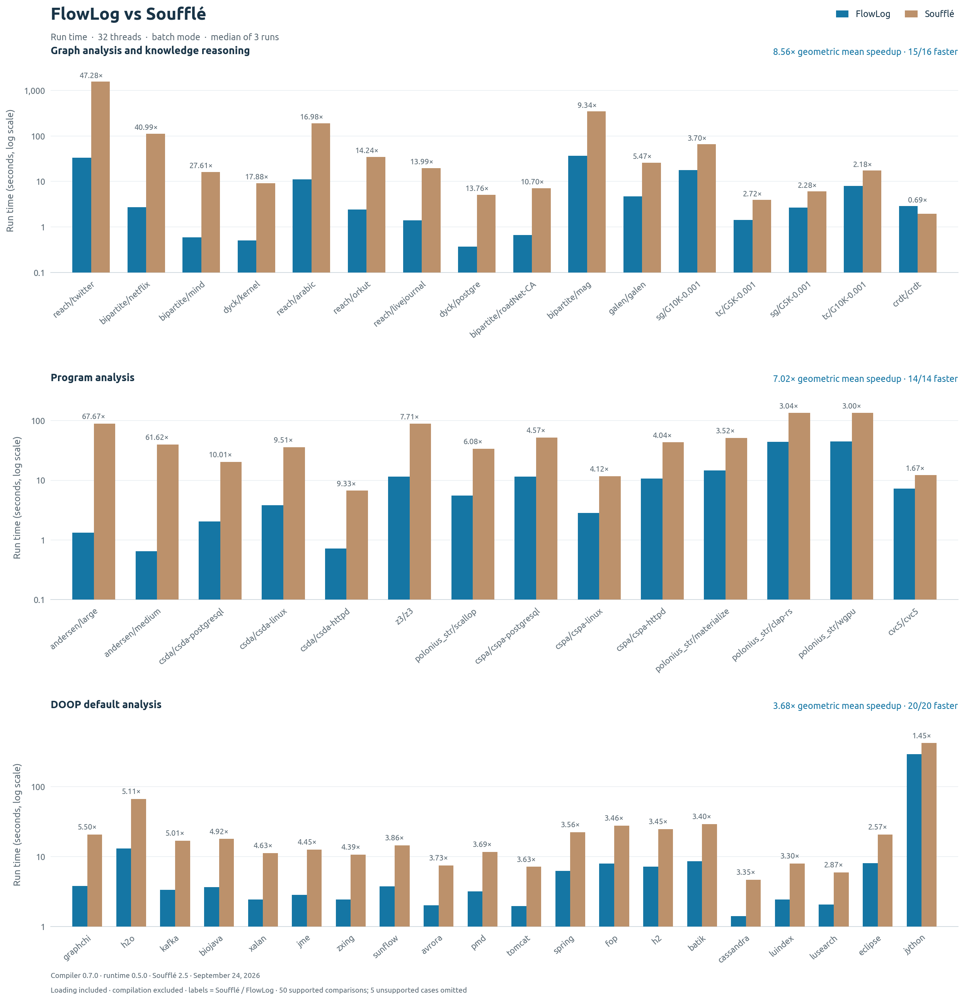
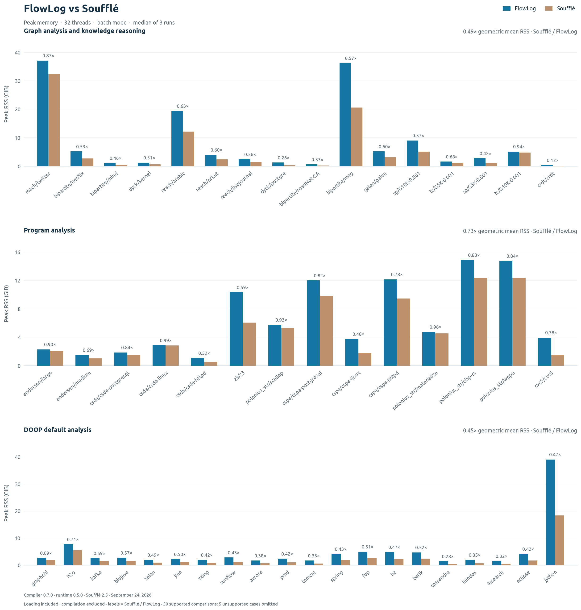
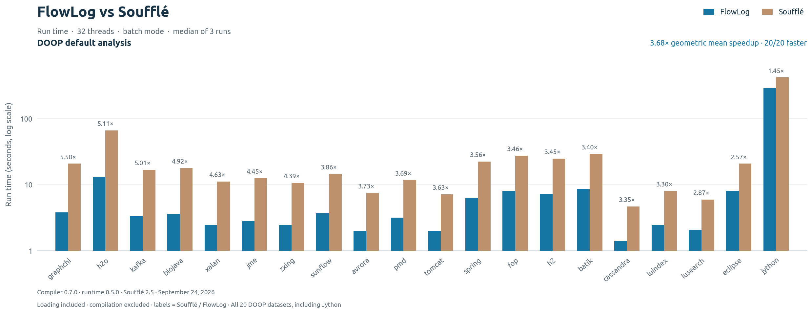

# FlowLog vs Soufflé: 32-thread benchmarks

September 24, 2026 · **FlowLog compiler 0.7.0 / runtime 0.5.0, batch mode** · **Soufflé 2.5**

**50 completed comparisons, 300 successful executions.** Five further canonical
cases have no Soufflé translation and are listed as unsupported, not failures.

| Scope | Comparisons | FlowLog faster | Geometric-mean speedup |
|---|---:|---:|---:|
| All supported cases | 50 | 49/50 | **5.78×** |
| DOOP | 20 | 20/20 | **3.68×** |

Speedup means **Soufflé wall time / FlowLog wall time**; above 1 favors FlowLog.
Soufflé used less peak memory in all 50 cases. The geometric-mean
FlowLog/Soufflé peak-RSS ratio was **1.88×**.

## All measured workloads

The panels separate graph/reasoning, program analysis, and DOOP so all labels
remain readable. Within each panel, both charts use descending runtime speedup
order. FlowLog uses its logo's blue (`#1576A4`); Soufflé uses muted copper
(`#BC916B`). Ubuntu typography matches
[FlowLog's brand font](https://github.com/flowlog-rs/flowlog-rs.github.io/blob/f6d409944f56595e12888b0e242c88fead14e6a8/src/css/custom.css),
with bold headings and light gridlines.





Vector versions: [runtime](all-time.svg) · [memory](all-memory.svg).
Memory uses a linear GiB scale, as in the engine README.

## DOOP




Vector versions: [runtime](doop-time.svg) · [memory](doop-memory.svg).

## Complete results table

Times are median **whole-process wall-clock seconds** over three executions,
including input loading but excluding compilation. RAM is the median of
per-execution peak RSS in MiB. Speedups use the unrounded recorded medians.

| Program | Dataset | FlowLog (s) | Soufflé (s) | Speedup | FlowLog RAM (MiB) | Soufflé RAM (MiB) |
|---|---|---:|---:|---:|---:|---:|
| tc | G5K-0.001 | 1.44 | 3.91 | 2.72× | 1,643.6 | 1,117.0 |
| tc | G10K-0.001 | 7.96 | 17.33 | 2.18× | 5,245.7 | 4,917.5 |
| sg | G5K-0.001 | 2.65 | 6.03 | 2.28× | 2,855.6 | 1,209.0 |
| sg | G10K-0.001 | 17.74 | 65.72 | 3.70× | 9,247.3 | 5,236.0 |
| reach | livejournal | 1.40 | 19.58 | 13.99× | 2,502.3 | 1,412.5 |
| reach | orkut | 2.44 | 34.74 | 14.24× | 4,096.5 | 2,453.5 |
| reach | arabic | 11.20 | 190.15 | 16.98× | 19,860.7 | 12,476.2 |
| reach | twitter | 33.06 | 1,563.09 | 47.28× | 38,027.2 | 33,187.6 |
| cc | livejournal | — | — | — | — | — |
| cc | arabic | — | — | — | — | — |
| cc | orkut | — | — | — | — | — |
| sssp | livejournal-sssp | — | — | — | — | — |
| sssp | orkut-sssp | — | — | — | — | — |
| bipartite | mind | 0.59 | 16.29 | 27.61× | 1,141.8 | 520.5 |
| bipartite | netflix | 2.73 | 111.91 | 40.99× | 5,308.7 | 2,811.0 |
| bipartite | mag | 37.02 | 345.92 | 9.34× | 37,138.7 | 21,111.0 |
| bipartite | roadNet-CA | 0.66 | 7.06 | 10.70× | 642.7 | 214.0 |
| dyck | kernel | 0.51 | 9.12 | 17.88× | 1,272.3 | 653.0 |
| dyck | postgre | 0.37 | 5.09 | 13.76× | 1,330.8 | 339.5 |
| crdt | crdt | 2.86 | 1.96 | 0.69× | 366.8 | 44.5 |
| galen | galen | 4.73 | 25.87 | 5.47× | 5,310.7 | 3,188.1 |
| andersen | medium | 0.65 | 40.05 | 61.62× | 1,528.3 | 1,048.5 |
| andersen | large | 1.33 | 90.00 | 67.67× | 2,349.7 | 2,108.5 |
| polonius_str | clap-rs | 44.34 | 134.74 | 3.04× | 15,237.9 | 12,645.5 |
| polonius_str | materialize | 14.71 | 51.73 | 3.52× | 4,854.8 | 4,641.5 |
| polonius_str | wgpu | 45.03 | 134.91 | 3.00× | 15,106.4 | 12,646.5 |
| polonius_str | scallop | 5.58 | 33.94 | 6.08× | 5,878.0 | 5,454.2 |
| cspa | cspa-httpd | 10.73 | 43.37 | 4.04× | 12,449.9 | 9,698.1 |
| cspa | cspa-linux | 2.84 | 11.71 | 4.12× | 3,838.9 | 1,824.9 |
| cspa | cspa-postgresql | 11.46 | 52.40 | 4.57× | 12,295.1 | 10,057.4 |
| csda | csda-httpd | 0.72 | 6.72 | 9.33× | 1,090.1 | 564.3 |
| csda | csda-linux | 3.80 | 36.12 | 9.51× | 2,940.7 | 2,905.4 |
| csda | csda-postgresql | 2.04 | 20.42 | 10.01× | 1,904.3 | 1,594.4 |
| cvc5 | cvc5 | 7.31 | 12.20 | 1.67× | 4,039.9 | 1,553.6 |
| z3 | z3 | 11.55 | 89.05 | 7.71× | 10,590.1 | 6,223.1 |
| doop | avrora | 2.00 | 7.45 | 3.73× | 1,754.5 | 671.7 |
| doop | batik | 8.59 | 29.18 | 3.40× | 4,822.7 | 2,489.5 |
| doop | biojava | 3.64 | 17.90 | 4.92× | 2,823.6 | 1,615.5 |
| doop | cassandra | 1.40 | 4.69 | 3.35× | 1,459.8 | 410.7 |
| doop | eclipse | 8.11 | 20.83 | 2.57× | 4,260.3 | 1,787.6 |
| doop | fop | 8.00 | 27.68 | 3.46× | 5,082.0 | 2,601.1 |
| doop | graphchi | 3.79 | 20.83 | 5.50× | 2,682.7 | 1,852.9 |
| doop | h2 | 7.19 | 24.80 | 3.45× | 4,927.0 | 2,324.6 |
| doop | h2o | 13.04 | 66.67 | 5.11× | 7,896.5 | 5,617.6 |
| doop | jme | 2.82 | 12.54 | 4.45× | 2,270.0 | 1,144.8 |
| doop | jython | 291.42 | 422.03 | 1.45× | 40,032.0 | 18,850.9 |
| doop | kafka | 3.36 | 16.83 | 5.01× | 2,640.6 | 1,553.3 |
| doop | luindex | 2.42 | 7.99 | 3.30× | 1,997.5 | 700.3 |
| doop | lusearch | 2.07 | 5.95 | 2.87× | 1,585.4 | 509.2 |
| doop | pmd | 3.18 | 11.74 | 3.69× | 2,477.5 | 1,046.9 |
| doop | spring | 6.28 | 22.36 | 3.56× | 4,231.6 | 1,814.1 |
| doop | sunflow | 3.77 | 14.55 | 3.86× | 2,894.7 | 1,253.5 |
| doop | tomcat | 1.97 | 7.15 | 3.63× | 1,746.5 | 607.5 |
| doop | xalan | 2.42 | 11.20 | 4.63× | 2,008.0 | 985.5 |
| doop | zxing | 2.42 | 10.62 | 4.39× | 2,032.6 | 851.6 |

**—**: no comparison was run because the pinned repository has no Soufflé
translation for that CC/SSSP case. Unsupported cases are excluded from all
aggregate ratios and plots.

All shared relation cardinalities agree across engines and all three attempts.
This is **not full tuple-by-tuple verification**. CSPA additionally reports
`MemoryAlias` and `ValueAlias` counts only on the FlowLog side; those two counts
were not cross-checked. The DOOP comparisons agree on all 26 shared reported
relation counts, including `VarPointsTo`.

## Method and provenance

| Setting | Value |
|---|---|
| Measurement interval | September 24, 2026, 07:37:18–11:46:14 UTC |
| FlowLog release commit | `07ffd67d96c68dad43e6f13d6325d7b1396a3249` |
| Benchmark corpus commit | `caa5f4afb630f8c275f3ea541f628f9c58245a8d` |
| Prepared dataset revision | `da9e91b3ff75d94604f57ba2b21ef3aa97e241ec` |
| Host | AMD EPYC 7763; 32 physical cores / 64 logical CPUs; approximately 503 GiB RAM |
| CPU placement | Same 32 physical cores for both engines; SMT siblings excluded; NUMA node 0 memory binding |
| FlowLog compilation | Release build; `--mode batch --str-intern`; runtime source pinned to the release commit |
| FlowLog execution | `-w 32` |
| Soufflé compilation | `souffle -o <binary> -j 32 -F <facts> <program>` |
| Soufflé execution | `<binary> -j 32 -F <facts> -D <output>` |
| Profiling | Disabled in both timed executables |
| Samples | Three measured executions per engine/case; engines and cases run serially |
| Time metric | GNU-time process wall time; 0.01-second resolution; compile time excluded |
| Memory metric | GNU-time peak RSS per execution; median reported |
| Cache policy | No explicit warm-up or cache flush; ordinary OS-cache behavior |
| Per-execution timeout | 1,800 seconds; no measured execution failed or timed out |
| Toolchain | Rust/Cargo 1.95.0; Soufflé 2.5 with OpenMP |
| Memory-map limit | `vm.max_map_count=1048576` during the run; previous value restored afterward |

The runtime's Rust files were compared against the published `flowlog-runtime`
0.5.0 crate and matched exactly. All 48 prepared input archives were SHA256
verified against the pinned HuggingFace dataset; the DOOP repository itself was
not downloaded.

The benchmark harness corrections included in this branch remove unintended
Soufflé profiling from timed binaries, accept the released FlowLog size-log
spacing, and let compilation failures return to the per-case runner. No engine
source or Datalog benchmark program was modified.

The canonical Twitter reachability case was attempted despite its historical
Soufflé skip tag and completed successfully. Only FlowLog and Soufflé were run:
LDBC has no Soufflé translation here; other engines, join-order ablations, and
cross-version regressions are outside this comparison.

## Data and plot reproduction

- [All 55 case outcomes](all_results.csv): the source of both the table and plots.
- [All 300 execution measurements](attempts.csv): portable timing/RSS data, without local filesystem paths.
- [Aggregate statistics](summary.json).
- [Machine-readable provenance](metadata.json).
- [Render script](render.py): reproduces the figures and this document, without rerunning benchmarks.

With Python, Matplotlib, NumPy, and the Ubuntu font installed, run from the
repository root. On Ubuntu the font package is `fonts-ubuntu`.
SVG text is saved as outlines so the typography is preserved on other systems.

```bash
python3 docs/benchmarks/2026-09-24/render.py
```

These plots use whole-process wall time for **both** engines. The harness's
older `Compiler_Total` column instead reports FlowLog's internal dataflow time;
it is preserved as `flowlog_dataflow_s` in the CSV but is **not** the plotted
baseline.
