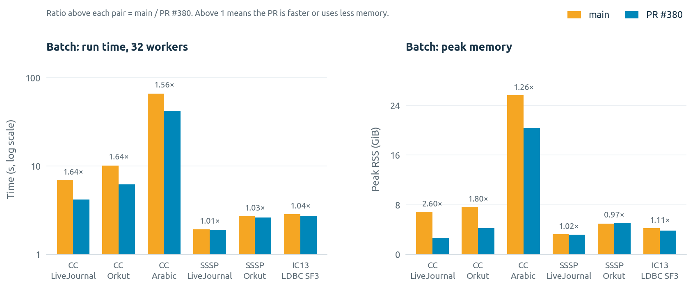
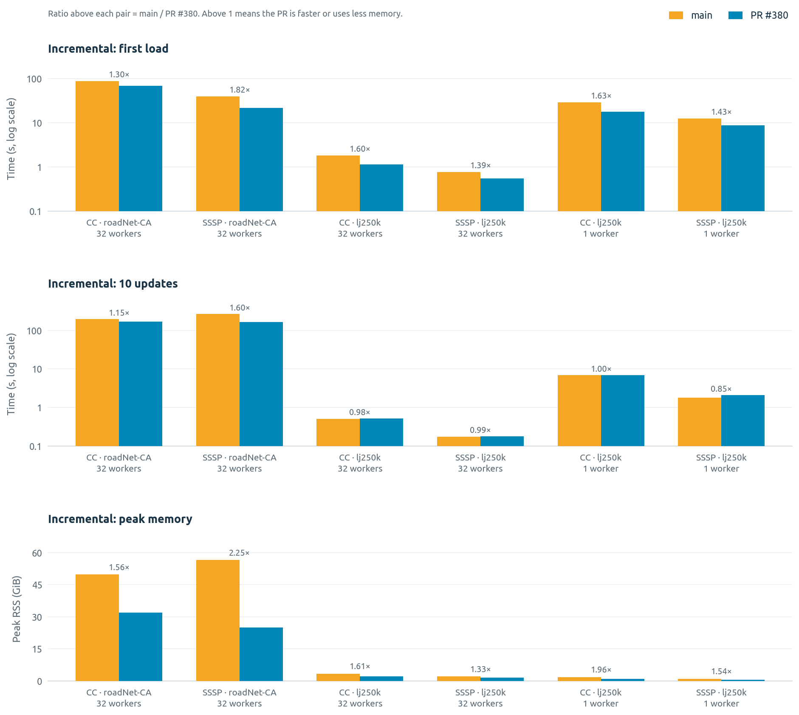

# Aggregates without the extra dedup

This folder holds the evidence for FlowLog
[PR #380](https://github.com/flowlog-rs/flowlog/pull/380). The PR removes a
duplicate-removal step (a *dedup*) that FlowLog ran before aggregates. Below
you'll find what the PR gains, what it costs, and the other designs we
measured.

## In short

- **Batch `min`/`max` is faster.** Connected components (CC) runs
  **1.6× faster** and uses up to **2.6× less memory**. SSSP and LDBC IC13
  gain 1–4%.
- **Incremental loads are faster.** The first load of CC and SSSP is
  **1.3–1.8× faster** and uses less memory. In the microbenchmark, loads get
  faster for `count` and `sum` too.
- **Incremental updates** are about the same or faster at 32 workers
  (0.97–1.60×). At 1 worker they can be slower (down to 0.85×). See
  [The cost](#the-cost).
- **The answers do not change.** Outputs match main in all 9 batch and
  11 incremental cases.
- **No new operator.** The PR uses only standard Differential Dataflow
  operators.

## What the PR changes

A *duplicate* is the same row derived in more than one way. For example, in
CC, node 7 gets the candidate label 1 once from every neighbour whose label
is 1. FlowLog used to remove duplicates before every aggregate. The PR keeps
that step only where duplicates would change the answer:

|  | `min`, `max` | `count`, `sum`, `avg` |
|---|---|---|
| **Batch** | dedup removed | dedup kept |
| **Incremental** | dedup removed | dedup removed |

Why the answers stay the same:

- **Batch `min`/`max`:** a repeat cannot change a minimum or a maximum,
  since min(1, 1, 3) = min(1, 3).
- **Batch `count`/`sum`/`avg`:** a repeat would be counted again (a count
  of 2 would become 4), so these keep the dedup.
- **Incremental:** the aggregate already gets each distinct row once,
  together with the number of ways it was derived. It uses the row once
  while that number is above zero. So the dedup was doing the same job a
  second time.

The dedup kept its own index of every row, so removing it saves both time
and memory.

## Batch results

32 workers. Each time is the median of 7 runs (3 on arabic), taken from
FlowLog's own "Dataflow executed" line. main is 438684e, and "PR" is PR #380
merged into it.

| Program | Dataset | main (s) | PR (s) | Speedup | Peak RSS (GiB), main → PR |
|---|---|---:|---:|---:|---:|
| cc | livejournal | 6.91 | 4.20 | 1.64× | 6.9 → 2.6 |
| cc | orkut | 10.15 | 6.20 | 1.64× | 7.6 → 4.2 |
| cc | arabic | 66.33 | 42.54 | 1.56× | 25.6 → 20.4 |
| sssp | livejournal-sssp | 1.92 | 1.90 | 1.01× | 3.2 → 3.2 |
| sssp | orkut-sssp | 2.69 | 2.61 | 1.03× | 4.9 → 5.1 |
| ic13 | ldbc_snb_interactive_sf3 | 2.84 | 2.72 | 1.04× | 4.2 → 3.8 |

## Incremental results

Each run loads a graph, then applies 10 transactions. Each transaction
inserts 1,000 edges and deletes 1,000 edges. *Load* is the time of the first
commit, and *10 updates* is the total time of the other ten.

The graphs:
- **lj250k** is LiveJournal cut down to node ids below 250,000 (5.8 M edges).
- **shuffled ids** is the same graph with its node ids renamed at random.
- **roadNet-CA** has 5.5 M edges.

main here is 8d2d1a9, the PR's base.

| Program | Graph | Workers | Runs | Load (s), main → PR | Speedup | 10 updates (s), main → PR | Speedup | Peak RSS (GiB), main → PR |
|---|---|---:|---:|---:|---:|---:|---:|---:|
| cc | roadNet-CA | 32 | 2 | 88.32 → 68.02 | 1.30× | 196.83 → 171.06 | 1.15× | 49.7 → 32.0 |
| sssp | roadNet-CA | 32 | 2 | 39.80 → 21.81 | 1.82× | 264.82 → 165.24 | 1.60× | 56.5 → 25.1 |
| cc | lj250k | 32 | 7 | 1.81 → 1.13 | 1.60× | 0.51 → 0.52 | 0.98× | 3.4 → 2.1 |
| cc | lj250k, shuffled ids | 32 | 7 | 1.93 → 1.21 | 1.60× | 0.64 → 0.65 | 0.97× | 3.4 → 2.3 |
| sssp | lj250k | 32 | 7 | 0.76 → 0.55 | 1.39× | 0.17 → 0.18 | 0.99× | 2.1 → 1.6 |
| cc | lj250k | 1 | 3 | 29.11 → 17.82 | 1.63× | 6.87 → 6.84 | 1.00× | 1.8 → 0.9 |
| cc | lj250k, shuffled ids | 1 | 3 | 32.24 → 20.23 | 1.59× | 9.11 → 10.06 | 0.91× | 2.0 → 1.0 |
| sssp | lj250k | 1 | 3 | 12.52 → 8.77 | 1.43× | 1.79 → 2.10 | 0.85× | 1.0 → 0.6 |

A recheck on today's main (438684e), with the PR merged into it:

| Program | Graph | Workers | Runs | Load (s), main → PR | Speedup | 10 updates (s), main → PR | Speedup | Peak RSS (GiB), main → PR |
|---|---|---:|---:|---:|---:|---:|---:|---:|
| cc | lj250k | 32 | 5 | 1.58 → 0.87 | 1.81× | 0.56 → 0.49 | 1.14× | 3.5 → 2.2 |
| cc | lj250k, shuffled ids | 32 | 5 | 1.88 → 1.10 | 1.71× | 0.70 → 0.67 | 1.05× | 3.4 → 2.3 |
| sssp | lj250k | 32 | 5 | 0.70 → 0.54 | 1.30× | 0.18 → 0.17 | 1.05× | 2.1 → 1.6 |

## The cost

Some updates only add or remove one more derivation of a row that already
exists. The row stays, so no answer changes. Before the PR, the dedup
absorbed these updates. Now they reach the aggregate, which re-reads the
row's whole group and finds nothing new. That extra work grows with the size
of the group, and it shows most at 1 worker.

| Where | Updates, PR vs main |
|---|---|
| Real programs, 32 workers | 0.97–1.60× (the same or faster) |
| Real programs, 1 worker | 0.85–1.00× (worst: sssp on lj250k) |
| Microbenchmark, mixed updates, 1 worker | down to 0.52× (1,000 values per group, each derived 4 ways) |
| Microbenchmark, only such updates, 1 worker | 4.5–4.7× slower with 4 values per group; 157–165× slower with 1,000 |
| Microbenchmark, only such updates, 32 workers | 1.7–2.3× slower with 4 values per group; 6.7–9.1× slower with 1,000 |

The last two rows are worst cases: every update in them is of this kind.

The full PR vs main microbenchmark (one aggregate, main and PR in one binary)

Each cell is the range over `min`, `max`, `sum` and `count`. Each round
inserts or deletes the two extreme values in some groups, which changes
their answers. In the "derived 4 ways" rows, each round also removes or
restores one derivation in other groups, which changes no answer. The
32-worker runs have 4× as many groups. Data: `microbench/pipelines/`.

| Groups × values | 1 worker: load | 1 worker: updates | 32 workers: load | 32 workers: updates |
|---|---:|---:|---:|---:|
| 1 M × 4 | 1.34–1.38× | 1.18–1.22× | 1.32–1.44× | 1.38–1.52× |
| 1 K × 4 K | 1.43× | 1.01–1.03× | 1.44–1.51× | 1.26–1.33× |
| 250 K × 4, derived 4 ways | 1.08–1.09× | 0.84–0.87× | 1.06–1.15× | 1.27–1.40× |
| 1 K × 1 K, derived 4 ways | 1.08–1.09× | 0.52× | 1.06–1.13× | 1.22–1.31× |

The same run measured batch `min`/`max` without the dedup: 1.25–3.13×
faster at 1 worker and 1.10–1.57× at 32 workers, using 0.68–1.01× the
memory.

## Other designs we measured

We tested each idea in a microbenchmark that puts all designs in one binary.
A few also went into the engine. "PR" means PR #380's version. For batch
`count`/`sum`, the PR is the same as main.

| Idea | Result | Taken? |
|---|---|---|
| **First/last value, incremental `min`/`max`** (`i-endpoint`). Read only the first or last of the sorted values instead of scanning them (Frank McSherry's `[0]` / `[-1]`). | No measurable gain. In one binary: min 0.2% faster (noise), max 1.5%. The scan takes only 0.7% of the CPU time. | No: no gain. |
| **First/last value, batch `min`/`max`** (`b-fused`). Index each group's values in order, then read the first or last. | Slower than the PR in 38 of 40 cases. Up to 3.8× slower at 1 worker; 7.5–34× slower when all rows are in one group. | No. |
| **Hash-table fold, batch `min`/`max`** (hash fold). A new operator keeps each group's current min or max in a hash table. | CC 2.0–2.5× faster than main (the PR: 1.5–1.7×); IC13 1.74× (the PR: 1.05×). 1.6–2.8× faster than the PR in the microbenchmark at 32 workers. | No: a new operator outside Differential Dataflow. |
| **Combine on each worker first, batch `min`/`max`** (`b-weights-combine`). Each worker folds its own rows in a hash table before sending them on. | 2.4–5.6× faster than the PR at 1 worker. At 32 workers 0.74–3.6×, with up to 1.9× the memory. | No: a new operator. |
| **Hash-table totals, batch `count`/`sum`** (`b-hash`). A new operator keeps each group's state in a hash table. | 1.8–3.1× faster than main with many groups, but 1.9–5.2× slower with one group, and up to 1.8× the memory. | No: a new operator, and slow on one big group. |
| **Sorted index per group, batch `count`/`sum`** (`b-fused`). Index each group's values in order, then add up the distinct ones. | Against main: 1.02–1.21× at 1 worker, 0.86–1.50× at 32 workers, but 6.7–15× slower when all rows are in one group. | Not yet: needs a fix for one big group. |
| **Running totals, incremental `count`/`sum`** (`inc-weight`). Keep a total per group with Differential Dataflow's `count_total`. It adds each change instead of re-reading the group, but it needs the dedup back. | Updates 2.1–71× faster than the PR at 1 worker; 0.76–1.51× at 32 workers. Loads 0.79–1.08×; up to 1.6× the memory. | Not yet: mixed at 32 workers. The best candidate for a follow-up. |
| **Two-level reduce, incremental `min`/`max`** (`i-hier`). Reduce small buckets of each group first, then the group. Standard operators only. | Groups of 1,000+ values: updates up to 49× faster than the PR, though a few were slower at 32 workers (down to 0.79×). Groups of 4 values: loads and updates up to 2.1× slower, with up to 1.6× the memory. | Not yet: it helps big groups and hurts small ones. |
| **Ordered state per group, incremental** (`i-custom`, `i-lean`). A new operator keeps each group's values in an ordered map. | At 32 workers: loads up to 1.8× faster than the PR and updates up to 44× faster, but some updates up to 4.8× slower, with up to 1.6× the memory. At 1 worker (`i-custom`): loads 1.6–2.3× and updates 2.9–1,200× faster, with up to 2.4× the memory. | No: a new operator. |

Also measured:
- A hash dedup before `count`/`sum` (`b-dedup-hash`, `b-dedup-local`):
  mixed, 0.83–1.35×.
- A hash dedup split by row (`b-pair-local`): 1.2–2.6× faster, but a new
  operator with up to 2.2× the memory.

Names in parentheses are the names used in the data. `inc-weight` is
described at the top of
[`aggregation_modes/main.rs`](../../../aggregates/programs/aggregation_modes/main.rs),
the hash fold in `patches/hash-fold.patch`, and the rest at the top of
[`aggregate_designs/main.rs`](../../../aggregates/programs/aggregate_designs/main.rs).

## How we measured

- **Machine:** one AMD EPYC 7763 VM with 32 cores (64 threads) and 503 GiB
  of RAM. Rust 1.95.0, Differential Dataflow 0.25.1, Timely 0.31.
- **Real programs:** the variants take turns, in an order that rotates each
  run. The first run is thrown away. We report medians. Processes were not
  pinned to cores.
- **Microbenchmarks:** pinned to one thread per physical core (1 or 32 of
  them). Ratios are paired within each run. Each `summary.json` gives 95%
  bootstrap intervals.
- **Answers:**
  - Batch runs compare a hash of the sorted output (`batch-outputs.csv`).
  - Incremental runs compare every output change of every commit
    (`incremental-outputs.csv`).
  - Microbenchmarks check their full output stream on every run.

**Commits:**

| Name | Commit |
|---|---|
| main | 438684e, today's main. Older rounds used 8d2d1a9, the PR's base. Between the two, only parser and arithmetic changes landed (flowlog-rs/flowlog#379, flowlog-rs/flowlog#381, flowlog-rs/flowlog#383). |
| PR | PR #380: e0c6446 (incremental) + 08f1ea2 (batch `min`/`max`). On 438684e we ran the PR merged into main. On 8d2d1a9 we ran the PR's own commits; the batch build there, 19ab062, has the same code as 08f1ea2, and only its comments differ. |
| hash fold | ffa4685 on 8d2d1a9: `patches/hash-fold.patch`. |

The hash fold on real programs (main 8d2d1a9, 32 workers, 5 runs, 3 on arabic)

| Program | Dataset | main (s) | PR (s) | hash fold (s) | PR speedup | hash fold speedup | Peak RSS (GiB), main → PR → hash fold |
|---|---|---:|---:|---:|---:|---:|---:|
| cc | livejournal | 7.18 | 4.23 | 2.89 | 1.70× | 2.48× | 6.9 → 2.9 → 2.7 |
| cc | orkut | 9.97 | 6.42 | 4.25 | 1.55× | 2.35× | 7.6 → 4.1 → 3.8 |
| cc | arabic | 65.68 | 42.79 | 33.14 | 1.54× | 1.98× | 26.2 → 20.2 → 19.2 |
| sssp | livejournal-sssp | 2.04 | 1.94 | 1.76 | 1.05× | 1.16× | 3.2 → 3.1 → 3.2 |
| ic13 | ldbc_snb_interactive_sf3 | 3.08 | 2.93 | 1.77 | 1.05× | 1.74× | 4.2 → 3.7 → 2.9 |

## Files

| Path | What it holds |
|---|---|
| `batch-programs.csv` | Every batch run: time, wall time, peak memory, result size. |
| `batch-outputs.csv` | Row count and output hash per batch case and variant. |
| `incremental-programs.csv` | Every incremental run: load, updates, the time of each commit, peak memory. |
| `incremental-outputs.csv` | Whether the variants gave the same output changes. |
| `batch.{png,svg}`, `incremental.{png,svg}` | The figures. |
| `render.py` | Draws the figures, prints the tables above, and checks the output files. |
| `microbench/pipelines/` | Whole aggregate pipelines: main, the PR, and prototypes. |
| `microbench/designs/` | The designs in [Other designs we measured](#other-designs-we-measured), side by side. |
| `microbench/hash-fold/` | The hash-table fold against main and the PR. |
| `microbench/incremental-endpoint/` | The first/last study for incremental `min`/`max`. `findings.json` sums it up. |
| `patches/` | The two designs we built into the engine and did not take. |

Each microbenchmark folder has `attempts.csv` (every run), `summary.json`
(medians and paired ratios) and `metadata.json` (parameters, FlowLog commit,
binary SHA-256).

## Reproduce

`python3 render.py` redraws the figures and prints the tables from the CSVs.
It needs matplotlib and numpy.

To run the benchmarks again, see
[`aggregates/README.md`](../../../aggregates/README.md).
