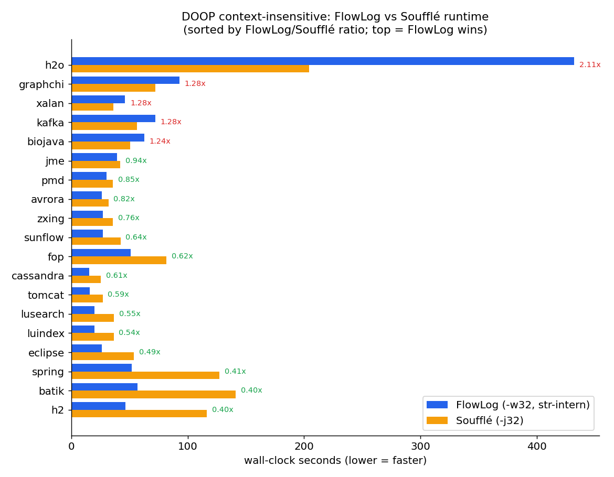
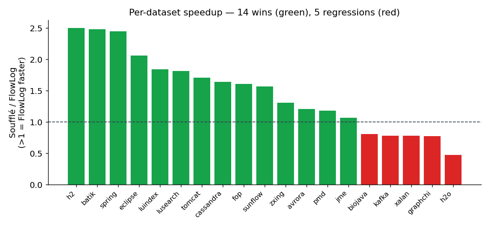
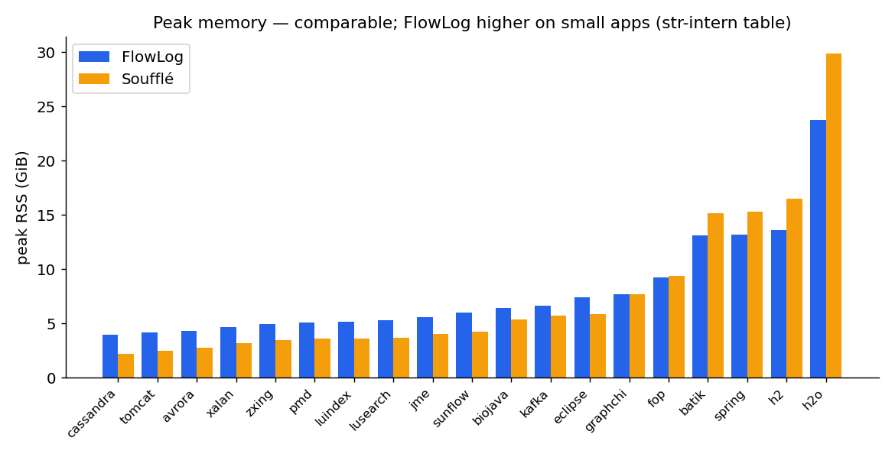
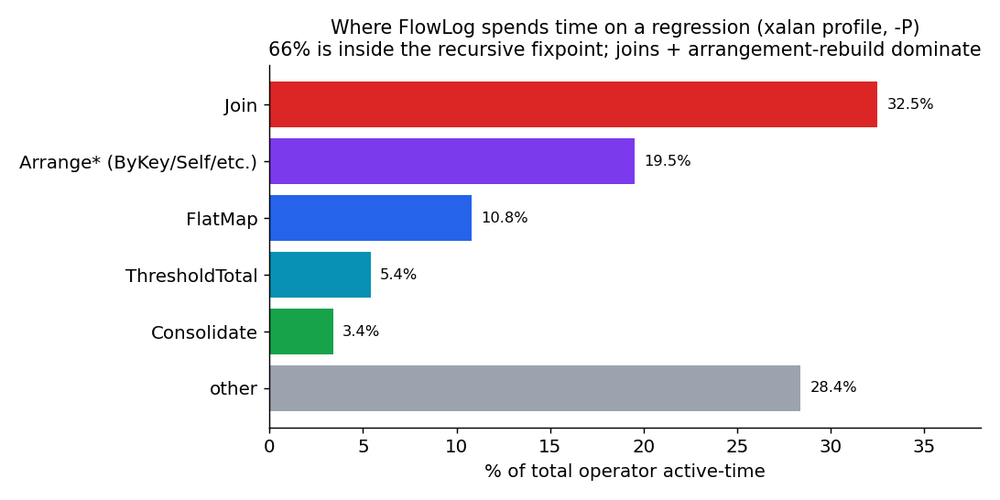
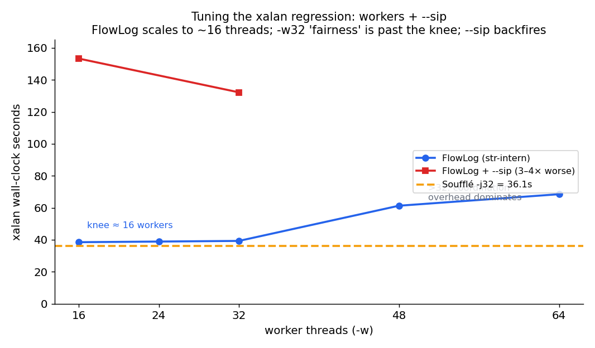

# [west3] DOOP context-insensitive — FlowLog vs Soufflé

Full (non-toy) DOOP **context-insensitive** points-to analysis, run through FlowLog
(`--str-intern`, `-w32`) and Soufflé (`-j32`, compiled) over **all 20 DaCapo
fact sets** that `doop.dl` uses. This is a *results* (correctness) comparison
**plus** a performance/regression study.

Reproduce: `make` n/a — `bash scripts/context_insensitive_compare.sh` (reads
`config/context_insensitive.txt`). Data: `docs/context_insensitive/summary.csv`.

---

## TL;DR

- **Correctness: identical on all 20.** Every output relation agrees on
  cardinality *and* tuples, modulo the documented `ord()` heap-representative
  renaming — and the `HeapRepresentative` **partitions are identical** on every
  dataset (244 classes on tomcat, …). No genuine divergence anywhere.
- **Performance: 14 wins (up to 2.5×), 5 regressions.** FlowLog wins on
  solve-heavy apps (batik, h2, spring, eclipse, …); it regresses on the denser
  ones — **h2o 2.11×**, graphchi / xalan / kafka **1.28×**, biojava **1.24×**.
- **jython** is pathological for *both* engines (~150–180 GB); FlowLog OOMs at
  `-w32` (knife-edge 178 GB) but **completes at `-w16` / `-w8`** (171 GB).
- **Root cause of the regressions** (FlowLog `-P` profile): the **recursive
  points-to fixpoint** — 66 % of time is inside the iterative scope, dominated
  by two large joins (~50 iterations) plus **~21 % rebuilding arrangements**.
  Differential-dataflow re-arranges dense relations every iteration; Soufflé's
  semi-naïve B-tree joins are cheaper on those workloads.
- **No user flag closes the gap.** `--str-intern` is **mandatory** (the program's
  `ord()` heap-merge requires it); `--sip` is **3–4× worse**; the worker knee is
  **~16** (>32 degrades; 48/64 are pathological). `-w16` is the best operating
  point and shrinks h2o from 2.11× to ~1.9×. The real fix is engine-side
  (arrangement sharing / less re-arrangement), not a knob.

---

## Runtime — 14 wins, 5 regressions

FlowLog wins where the solve dominates and its parallel integer-key joins pay off
(batik 0.40×, h2 0.40×, spring 0.41×). It loses on denser fixpoints where
per-iteration arrangement maintenance dominates.

## Peak memory — comparable

Peak RSS is in the same ballpark; FlowLog is higher on small apps (the resident
str-intern table) and comparable-to-lower on the big ones (batik 13.4 vs 15.5 GB).
`jython` is the exception — dense enough to need ~170–180 GB on *both* engines.

## What's actually slow (xalan `-P` profile)

66 % of operator-active-time is inside the recursive (`Iterative`) scope; within
it, **joins (32 %) + arrangement rebuild (~21 %)** dominate. The two hottest
joins run ~50 fixpoint iterations (16.5 s + 7.1 s). This is the VarPointsTo
propagation — the cost is re-arranging large recursive relations each round.

## Tuning experiments (xalan)

| lever | result |
|-------|--------|
| `--str-intern` off | **impossible** — `ord()` (heap-merge `min(ord(heap))`) requires interning |
| `--sip` | **3–4× worse** (xalan 38 s → 132–153 s); SIP plans backfire here |
| workers | knee ≈ **16**; `-w32` slightly past it; `-w48/64` pathological (1.6×) |
| `-w16` vs `-w32` | xalan 38.2 vs 39.3 s; **h2o 396 vs 432 s** (helps the worst case) |

**Takeaway:** the regressions are intrinsic to differential-dataflow's
evaluation of these dense points-to fixpoints, not a misconfiguration. Lowering
workers to ~16 is a cheap, safe win (the `-w32` "fairness" setting is past
FlowLog's scaling knee); the durable fix is reducing arrangement churn in the
recursive scope.

---

## Full results

See `summary.csv`. Verdict `MATCH` = all non-`HeapRepresentative` relations equal
cardinality, `HeapRepresentative` partition identical, 0 missing.

| dataset | verdict | FlowLog s | Soufflé s | ratio | FlowLog GB | Soufflé GB |
|---------|---------|-----------|-----------|-------|-----------|-----------|
| h2o | MATCH | 432.0 | 204.5 | **2.11×** | 23.8 | 29.9 |
| graphchi | MATCH | 92.9 | 72.3 | 1.28× | 7.7 | 7.7 |
| xalan | MATCH | 46.3 | 36.1 | 1.28× | 4.7 | 3.2 |
| kafka | MATCH | 72.3 | 56.4 | 1.28× | 6.6 | 5.7 |
| biojava | MATCH | 62.9 | 50.7 | 1.24× | 6.5 | 5.4 |
| jme | MATCH | 39.6 | 42.3 | 0.94× | 5.6 | 4.0 |
| pmd | MATCH | 30.5 | 36.0 | 0.85× | 5.1 | 3.6 |
| avrora | MATCH | 26.4 | 32.0 | 0.82× | 4.3 | 2.8 |
| zxing | MATCH | 27.3 | 35.8 | 0.76× | 5.0 | 3.4 |
| sunflow | MATCH | 27.0 | 42.4 | 0.64× | 6.0 | 4.3 |
| fop | MATCH | 51.0 | 81.9 | 0.62× | 9.3 | 9.4 |
| cassandra | MATCH | 15.6 | 25.6 | 0.61× | 4.0 | 2.2 |
| tomcat | MATCH | 15.8 | 27.0 | 0.59× | 4.2 | 2.5 |
| lusearch | MATCH | 20.2 | 36.7 | 0.55× | 5.3 | 3.7 |
| luindex | MATCH | 19.8 | 36.5 | 0.54× | 5.2 | 3.6 |
| eclipse | MATCH | 26.1 | 53.8 | 0.49× | 7.4 | 5.9 |
| spring | MATCH | 52.0 | 127.4 | 0.41× | 13.2 | 15.3 |
| batik | MATCH | 56.9 | 141.4 | 0.40× | 13.1 | 15.2 |
| h2 | MATCH | 46.6 | 116.6 | 0.40× | 13.6 | 16.5 |
| jython | MATCH* | 171 (`-w16`) | ~180+ | — | 167 | ~150+ |

\* jython OOMs FlowLog at `-w32` (knife-edge); completes at `-w16`. Both engines
need ~150–180 GB. Single-run timings carry run-to-run noise (the `ord()`
heap-representative non-determinism), but the win/loss pattern is stable.

## Methodology

- Programs: `programs/oracle/{flowlog,souffle}/context_insensitive*.dl` — the same
  analysis in two dialects (head vs body aggregates, `?`-vars), `CONFIGURATION`
  bound to `ContextInsensitiveConfiguration`, `+HeapRepresentative` output for the
  partition check.
- Facts: `/datasets/facts/<app>` via a tmpfs overlay (symlinks + empty keep-spec
  defaults Soufflé requires); never written into the shared mount.
- Oracle: `scripts/lib/compare-flowlog-souffle.py` (vendored from
  `flowlog-rs/doop-flowlog`) — tuple-set per relation, `--partition
  HeapRepresentative`.
