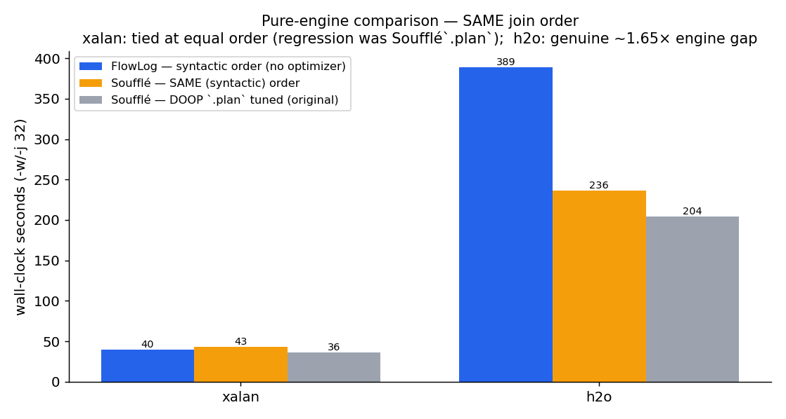
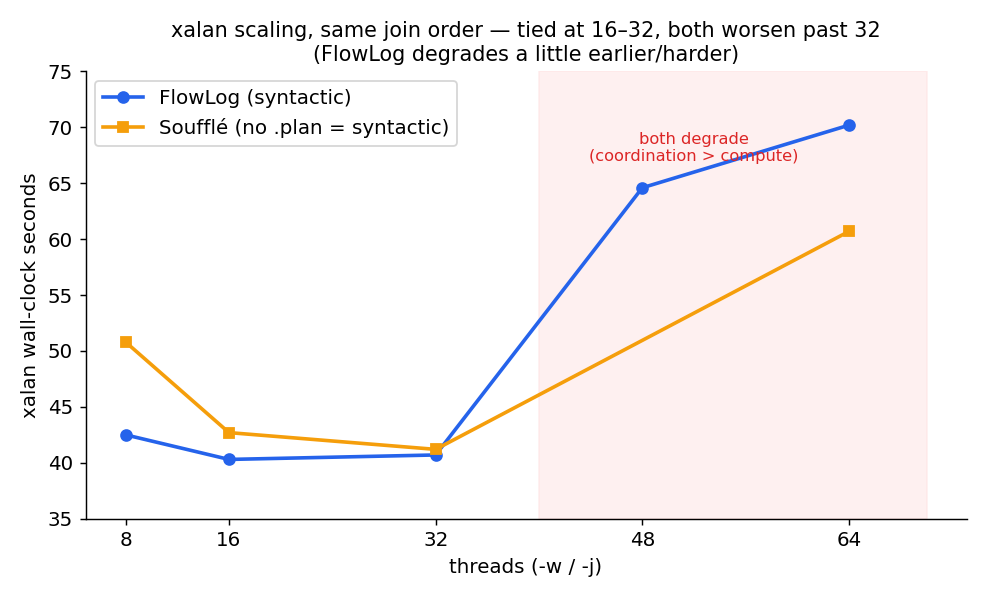
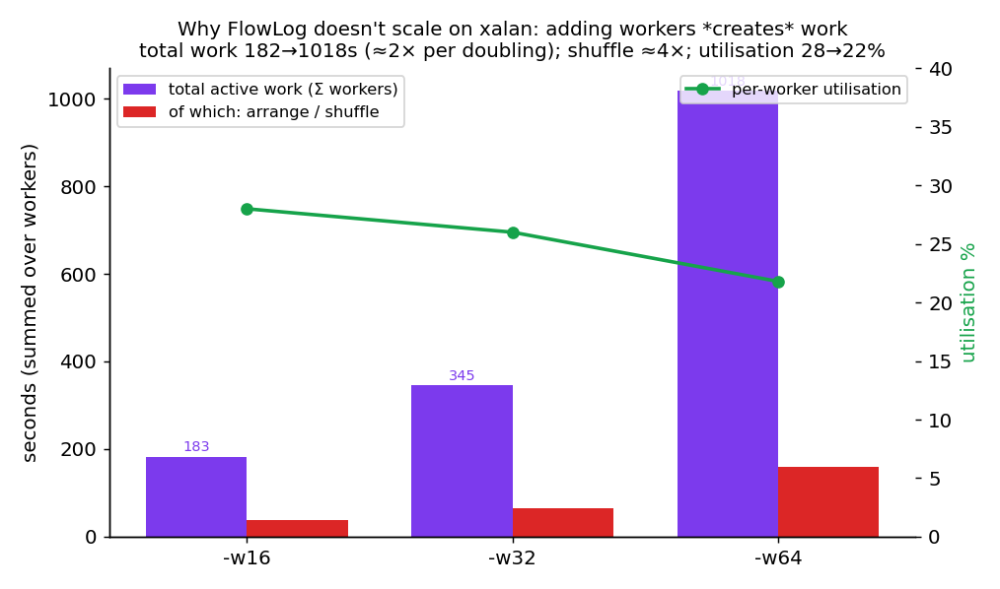
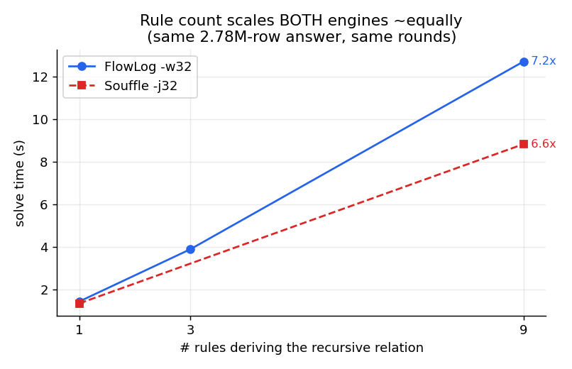
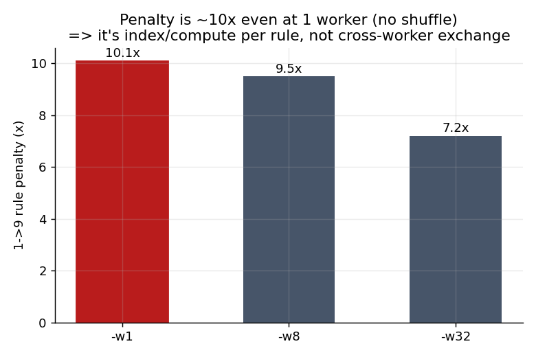
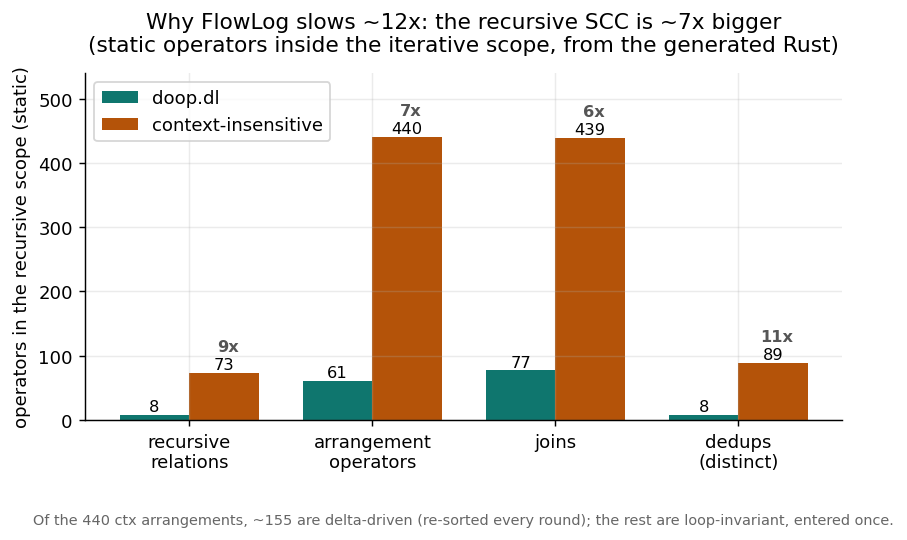
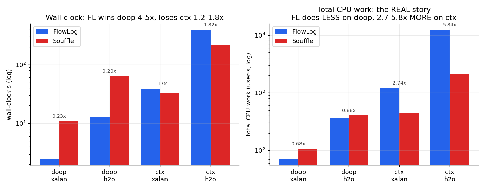
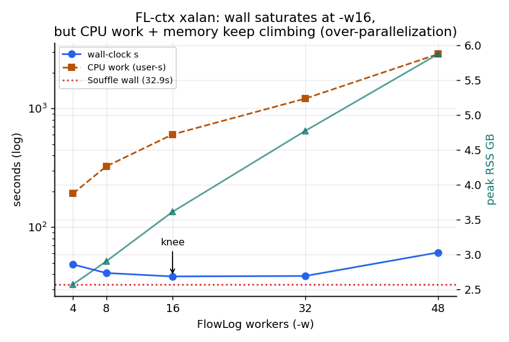
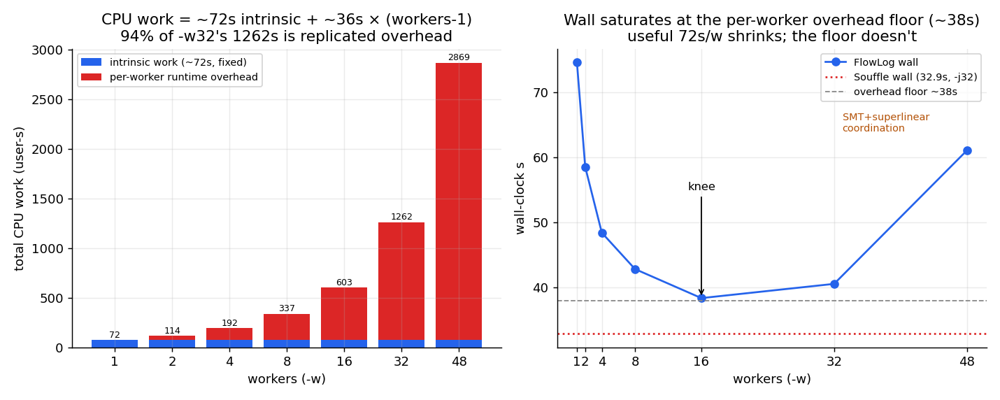

# [west3] DOOP context-insensitive — FlowLog vs Soufflé

Full (non-toy) DOOP **context-insensitive** points-to analysis, run through FlowLog
(`--str-intern`, `-w32`) and Soufflé (`-j32`, compiled) over **all 20 DaCapo
fact sets** that `doop.dl` uses. This is a *results* (correctness) comparison
**plus** a performance/regression study.

Reproduce: `make` n/a — `bash scripts/context_insensitive_compare.sh` (reads
`config/context_insensitive.txt`). Data: `docs/context_insensitive/summary.csv`.

---

## TL;DR

- **Correctness: identical on all 19 cross-checked datasets.** Every output
  relation agrees on cardinality *and* tuples, modulo the documented `ord()`
  heap-representative renaming — and the `HeapRepresentative` **partitions are
  identical** on every one (244 classes on tomcat, …). No genuine divergence.
  (jython is the 20th: too dense to cross-check in budget — see below.)
- **Performance (default settings): 14 wins (up to 2.5×), 5 regressions** —
  **h2o 2.11×**, graphchi / xalan / kafka **1.28×**, biojava **1.24×**. *But the
  default comparison is unfair:* Soufflé runs DOOP's hand-tuned `.plan` join
  orders on the hot recursive rules; FlowLog runs syntactic order (no `.plan`).
- **Pure-engine, SAME join order** (Soufflé `.plan` stripped + strict SIPS;
  FlowLog already syntactic): the moderate regressions **vanish** — xalan is a
  **tie** (FlowLog 39.8 s vs Soufflé 41–45 s). They were Soufflé's *optimizer*,
  not its engine. **h2o is the exception**: a genuine **~1.65× engine gap** even
  at equal order (389 vs 236 s) — the largest/densest workload — though FlowLog
  there uses **less** memory (24.5 vs 29.9 GB).
- **vs the old `doop.dl` baseline, the slowdown is the recursive-SCC *size*, not the
  engine and not rule count.** On the *same* binary/flags/facts, xalan goes doop.dl
  **3.1 s → 39.2 s (12.6×)** and h2o **12 s → ~410 s (34×)**, while Soufflé only slows
  3.9×. Yet context-insensitive computes a **smaller** VarPointsTo (heap merging). Two
  controlled experiments + reading the generated Rust isolate the cause: (i) rule count
  is **not** FlowLog-specific — a 1→9-rule micro-benchmark scales FlowLog **7.2×** and
  Soufflé **6.6×** alike; (ii) the artifact shows the real driver — the context-
  insensitive VarPointsTo fixpoint is **one iterative scope with 73 co-recursive
  relations / 440 arrangement operators / 439 joins, vs doop.dl's 8 / 61 / 77 (~7×)**.
  Of those, the **delta-driven subset re-sorted every round (~50)** is what #11's
  profiler counts as **~155 live arrangements** (the rest are loop-invariant indexes
  `enter()`ed once); both numbers describe the same ~7× bloated recursive scope.
  FlowLog's cost ≈ (live SCC operators) × rounds, so the ~7× ≈ the ~12×. Arity-4 dead
  columns add only ~15 % (mostly memory); the new aggregates are one-shot. See *Why
  slower than the old `doop.dl`* below + plots.
- **jython** is pathological for *both* engines (~150–180 GB). FlowLog OOMs at
  `-w32` (knife-edge 178 GB) but **completes at `-w16` / `-w8`** (171 GB); the
  matched Soufflé run was still going at 150 GB / 22 min when stopped, so jython
  is **not yet cross-checked** (it is the one dataset without a MATCH verdict).
- **Where FlowLog's time goes** (FlowLog `-P` profile, xalan): **66 %** inside
  the recursive fixpoint — joins + **~21 % rebuilding arrangements** each
  iteration. That overhead is what costs at h2o scale; below it, FlowLog's
  parallel integer-key joins win.
- **Actionable.** `--sip` is **3–4× worse** and `--str-intern` is **mandatory**
  (`ord()` needs it), so neither is the answer. **FlowLog *supports* `.plan`** —
  porting DOOP's join-order hints should close the moderate regressions; the h2o
  engine gap (arrangement churn) is the one real engine target. `-w16` is a free
  win (the `-w32` "fairness" setting is past FlowLog's scaling knee).

---

## Runtime — 14 wins, 5 regressions

FlowLog wins where the solve dominates and its parallel integer-key joins pay off
(batik 0.40×, h2 0.40×, spring 0.41×). It loses on denser fixpoints where
per-iteration arrangement maintenance dominates.

## Pure-engine — the same join order

The runtime chart above is **unfair to FlowLog**: Soufflé runs DOOP's hand-tuned
`.plan` join orders on the hot recursive rules (16 `.plan` directives in the
`.dl`), while FlowLog has none and runs syntactic order. To isolate the *engine*
from the *optimizer*, re-run with the **same join order** on both — Soufflé with
`.plan` stripped + `.pragma "SIPS" "strict"` (syntactic), FlowLog as-is
(syntactic by default). Outputs are byte-identical (VarPointsTo matches).

- **xalan: a tie.** FlowLog 39.8 s vs Soufflé-same-order 41–45 s (Soufflé-tuned
  36.1 s). The 1.28× "regression" was **entirely Soufflé's `.plan` tuning** — at
  equal join order FlowLog's engine is as fast or faster. The other 1.24–1.28×
  regressions (kafka, graphchi, biojava) are the same shape.
- **h2o: a real engine gap.** Even at equal order Soufflé is **1.65× faster**
  (236 vs 389 s) — differential-dataflow's per-iteration re-arrangement genuinely
  costs on the largest, densest workload. FlowLog does use **less** memory here
  (24.5 vs 29.9 GB).

So the regression list is two different things: **mostly the planner** (closeable
— FlowLog *supports* `.plan`, the orders just aren't emitted by the mirror), plus
**one true engine gap at h2o scale**.

## xalan deep-dive — why it's "slow", and why it doesn't scale

Using xalan as the lightweight probe (40 s, 2.4 M VarPointsTo over ~50 fixpoint
iterations), on the **same syntactic plan** (souffle `.plan` stripped — and
souffle's *default* SIPS already equals syntactic order for these chain joins, so
"just no `.plan`" suffices):

- **At the sweet spot it's a tie, not slow.** 16–32 threads: FlowLog ~40 s ≈
  Soufflé ~41 s. The "slowness" was the `.plan` tuning, not the engine.
- **Neither scales past ~32 threads; FlowLog degrades a bit earlier/harder**
  (40→65→70 s at 32→48→64; Soufflé 41→61 s at 32→64). xalan is small, so there's
  little work to parallelise and a lot of per-iteration coordination.

**Why FlowLog stops scaling** — from the `-P` per-worker profile at -w16/32/64:

| -w | wall | Σ active work | util % | shuffle (arrange) | activations | skew (max/mean) |
|----|------|---------------|--------|-------------------|-------------|------------------|
| 16 | 40.7 s | 183 s | 28 % | 38.6 s | 21.4 M | 3.24× |
| 32 | 41.5 s | 345 s | 26 % | 65.1 s | 41.2 M | 3.46× |
| 64 | 72.9 s | **1018 s** | 22 % | **159.8 s** | **84.8 M** | 4.04× |

1. **Adding workers *creates* work, not just splits it.** Total active work
   **182 → 345 → 1018 s** — ≈2× per worker-doubling. Throughput can't keep up, so
   wall time *rises*.
2. **The cross-worker shuffle is the culprit.** The recursive fixpoint
   re-`Arrange`s (all-to-all exchanges) the points-to deltas **every** one of ~50
   iterations; that arrange time grows **~4×** (38.6 → 159.8 s). Soufflé updates
   shared in-memory B-trees in place — no per-round exchange.
3. **Utilisation is low and falling (28 → 22 %).** Workers idle most of the time,
   blocked on per-iteration progress barriers and on exchange.
4. **Scheduler overhead explodes.** 21 → 85 M operator activations — more workers
   ⇒ smaller per-worker batches ⇒ more wake-ups for the same tuples.
5. **Key skew (3.2 → 4.0×).** A few hot points-to keys (heavily-pointed vars/heaps)
   overload some workers while the rest sit off the critical path, so extra
   workers don't shorten the longest worker.

**Bottom line:** FlowLog's differential-dataflow model pays an *exchange +
barrier* tax **per iteration**. On a low-arithmetic-intensity, skewed, ~50-round
fixpoint like xalan, that tax is hidden at 16–32 threads (tie with Soufflé) but
dominates past them — and is exactly the cost that makes h2o a real engine gap.
Actionable: cap workers at ~16 here; engine-side, the wins are fewer/cheaper
re-arrangements in the recursive scope (delta-arrangement reuse) and skew-aware
key distribution.

## Why slower than the old `doop.dl`? — the recursive-SCC size, not the engine

The earlier `doop.dl` benchmark had FlowLog **3× faster** than Soufflé on xalan
(3.1 s vs 9.4 s, historical perf-snapshot). Context-insensitive flips that to a
tie/slight-loss. To isolate *why*, run **both programs on the same FlowLog binary,
same `--str-intern -w32`, same facts** — the only variable is the `.dl`:

| dataset | program | FlowLog | peak | VarPointsTo | Soufflé |
|---------|---------|---------|------|-------------|---------|
| xalan | `doop.dl` | **3.1 s** | 2.2 GB | 2.74 M (arity-2) | 9.4 s |
| xalan | context-insensitive | **39.2 s** | 4.7 GB | 2.39 M (arity-4) | 36.1 s |
| h2o | `doop.dl` | **12.0 s** | 8.3 GB | 17.9 M (arity-2) | — |
| h2o | context-insensitive | **~410 s** | 24 GB | 8.35 M (arity-4) | 205 s |

FlowLog's `doop→ctx` slowdown is **12.6× (xalan) / 34× (h2o)**; Soufflé's is **3.9×**.

**It is not "more work," and it is not rule count alone.** Context-insensitive
computes a **smaller** VarPointsTo on both datasets (it merges heaps), yet runs
12–34× slower. Two controlled experiments plus **reading the generated Rust**
(`flowlog-compiler --save-temps`) pin down the cause.

**Experiment A — rule count is NOT FlowLog-specific.** A micro-benchmark (recursive
transitive-closure, **identical 2.78 M-row answer, same rounds**) where the only knob
is the number of rules deriving the recursive relation:

| recursive relation | 1 rule | 9 rules | engine |
|--------------------|--------|---------|--------|
| arity-2 `(x,y)` | 1.43 s | **12.73 s** (7.2×) | FlowLog -w32 |
| arity-2 `(x,y)` | 1.34 s | **8.84 s** (6.6×) | **Soufflé -j32** |
| arity-4 `(0,x,0,y)` (2 dead cols) | 1.64 s | 14.73 s | FlowLog -w32 |

Both engines scale ~**7× the same way** with rule count — so "more rules" explains
Soufflé's 3.9× but **cannot** be FlowLog's extra penalty. (A worker sweep shows the
1→9 penalty is **10.1× even at `-w1`** — no cross-worker shuffle — so it is
compute/index, not exchange.) 

**Experiment B — read the artifact (the real driver).** The generated Rust shows each
recursive relation compiles to **one shared arrangement and one dedup**: the codegen
CSEs arrangements (438/440 distinct — no per-rule rebuild) and emits a single
`threshold_semigroup` after `concat`-ing all a relation's rules. (So an earlier
"per-rule index" guess was wrong.) What actually explodes is the **size of the
recursive SCC**. Census of the generated VarPointsTo fixpoint — static operator count
in the recursive scope (lines counted strictly inside the `iterative(|inner| …)`
closure):

| operator in recursive scope | doop.dl | context-insensitive | ratio |
|--------------------|---------|---------------------|-------|
| recursive relations (`Variable`) | 8 | 73 | 9× |
| arrangement operators | 61 | 440 | 7× |
| joins (`join_core`) | 77 | 439 | 6× |
| dedups (`threshold`) | 8 | 89 | 11× |

The context-insensitive points-to fixpoint is **one iterative scope ~7× bigger than
doop.dl's**. Not all 440 arrangement operators are re-sorted each round: ~200 are
loop-invariant indexes `enter()`ed once and reused, while the **delta-driven subset
re-sorted every iteration is ~155** (the number #11's profiler reports as "live
arrangements" — consistent, just a different cut of the same scope). FlowLog's solve ≈
(live SCC operators) × rounds × per-operator cost, so a ~7× bigger SCC ≈ the ~12× (the rest from bigger relations / more rounds / the +15 %
width). This is the real answer: not rule count, not the answer size — the **operator
count of the recursive scope**.

**Why Soufflé only 3.9×.** It runs the same ~7× more rules, but (a) keeps flat
current-set B-trees instead of differential dataflow's per-iteration arrangement
**traces** (lower per-operator constant), and (b) uses DOOP's hand-tuned `.plan` join
orders. At doop scale FlowLog's parallel joins win 3×; at context-insensitive scale
the per-round cost of ~7× more differential operators erases the lead. (Honest caveat:
the tiny `doop.dl` baseline *flatters* FlowLog — much of the "regression" is the 3×
lead closing at scale, not FlowLog getting worse in absolute terms.)

**Ruled out:** arity-4 dead columns (~15 %, mostly memory — Experiment A row 3); the
12 `min(ord(heap))`/`count` aggregates (one-shot heap-merge/stats, none reference the
recursive relations); redundant arrangements (CSE'd by the codegen).

**Optimization opportunities for FlowLog** (artifact-grounded, highest leverage first):

1. **SCC decomposition / stratification.** 73 relations sit in **one** iterative scope.
   Many (`lambda*`, `invokedynamic*`, `methodhandle*`, `runningthread`, `boxtypeconversion`…)
   look only weakly connected to the VarPointsTo core; if FlowLog's SCC detection is
   coarse, splitting them into their own smaller strata lets sub-fixpoints converge in
   a few rounds instead of iterating ~50× alongside the whole 440-arrangement loop.
2. **Lighter arrangements/dedup in `datalog-batch` mode.** Batch only needs the final
   set, yet the generated loop uses differential's per-iteration trace machinery for
   the ~155 delta-driven arrangements + 89 `threshold`s (out of 440 total). A flat
   "current-set" index/distinct for batch mode would cut the per-operator constant that
   the SCC size multiplies.
3. **Emit DOOP's `.plan` join-order hints** (FlowLog supports `.plan`) — closes
   Soufflé's tuning advantage at equal engine.
4. **Drop the two constant context columns** (arity-4 → arity-2) — ~15 %, mostly memory.

Data + repro: `doop_baseline.csv`.

## Engine vs engine — the 2×2×2 (the CPU-work view)

`{FlowLog, Soufflé} × {doop.dl, context-insensitive} × {xalan, h2o}`, **both at 32
threads, left-to-right** (FlowLog `--str-intern -w32`; Soufflé `-j32` compile **and**
run, `.plan` stripped). VarPointsTo cross-checks equal (xalan 2.39 M, h2o 8.35 M).
Data: `engine_2x2x2.csv`.

| program | dataset | wall FL/SF | **CPU-work FL/SF** | mem FL/SF |
|---------|---------|-----------|--------------------|-----------|
| doop.dl | xalan | **0.23×** (FL 4.3× faster) | 0.68× | 2.3× |
| doop.dl | h2o | **0.20×** (FL 5.0× faster) | 0.88× | 1.5× |
| context-insensitive | xalan | 1.17× | **2.74×** | 1.8× |
| context-insensitive | h2o | 1.82× | **5.84×** | **0.83×** |

The headline metric is **total CPU work (user-time), not wall-clock.** It removes the
parallelism confound and shows exactly what happens:

- **doop.dl: FlowLog does *less* total work than Soufflé** (0.68–0.88×) *and* lights up
  ~30 cores vs Soufflé's ~7–10 → it wins wall **4–5×**. Differential dataflow's
  parallel integer-key joins are simply more efficient here.
- **context-insensitive: FlowLog's total work *explodes* to 2.74× (xalan) / 5.84×
  (h2o)** Soufflé's. Even pinning 32 cores it can't outrun a ~6× work deficit, so it
  loses wall 1.2–1.8×. The `doop→ctx` swing in *relative CPU work* is **4.1× (xalan) /
  6.6× (h2o)** — that is the regression, and it is **compute, not a scheduling artifact**.
- **Per output tuple**, FlowLog spends **504 µs (xalan) / 1470 µs (h2o)** of CPU on
  context-insensitive vs Soufflé's 184 / 252 µs.

**Where the extra work comes from (and where it doesn't).** It is *not* a bigger
recursive core or `.comp` non-reuse: the recursive SCC is the **same size in both
engines** — FlowLog 73 `Variable`s, Soufflé **72 relations** (computed from
`souffle --show=scc-graph`). Soufflé's optimiser inlines **602 → 375** relations;
FlowLog prunes only unreachable ones (**602 → 437**), so it materialises ~62 more — but
those are all **non-recursive** (evaluated once), worth the ~1.17× relation count, not
the ~6× work. The work gap is **differential dataflow's per-round arrangement/trace
maintenance over the shared ~72-relation SCC × ~50 rounds**: 439 `join_core` + ~155
delta-driven arrangements are scheduled and their traces merged every iteration, a
higher per-operator constant than Soufflé's in-place semi-naïve B-tree update. doop.dl's
8-relation SCC is too small for that constant to matter; the 72-relation SCC makes it dominate.

**Memory.** FlowLog is heavier on the small/doop cases (1.5–2.3×: resident str-intern
table + arrangement traces) but **lower on the largest workload** (h2o ctx **24.0 vs
28.9 GB, 0.83×**) — `--str-intern` compacts the arity-4 tuples while Soufflé's B-trees
balloon. So memory is *not* FlowLog's problem at scale; CPU work is.

**The one obvious, free optimisation — stop over-parallelising.** FL-ctx xalan worker sweep:

| -w | wall | CPU work | peak RSS |
|----|------|----------|----------|
| 8 | 41.0 s | 324 s | 2.90 GB |
| **16** | **38.4 s** | **603 s** | **3.61 GB** |
| 32 | 38.7 s | 1210 s | 4.77 GB |
| 48 | 61.1 s | 2869 s | 5.87 GB |

Wall **saturates at `-w16`**; `-w32` *doubles* CPU work (603 → 1210 s) and adds 32 %
memory for **zero** wall gain; `-w48` regresses. **`-w16` gives the same wall as `-w32`
at half the CPU and 24 % less RAM** — and closes the Soufflé CPU-work gap from 2.74× to
~1.37×. Adding workers *creates* coordination work rather than splitting it (CPU grows
~linearly with `-w`), the classic differential all-to-all-exchange tax.

**Optimisation summary for these workloads:** (1) **bench/run context-insensitive at
`-w8–16`, not `-w32`** — free CPU+memory win, no wall cost; (2) engine: **lighter
batch-mode arrangements** (drop per-iteration trace retention in `datalog-batch`) and
operator fusion to cut the per-operator constant the 72-relation SCC multiplies;
(3) **inline copy/projection relations** (the 62 FlowLog keeps but Soufflé doesn't) for
a smaller dataflow; (4) `.plan` hints and dropping the 2 constant context columns are
minor here. doop.dl needs nothing — FlowLog already wins it 4–5×.

## Why it over-parallelizes — and how to scale it (diagnosis)

The worker sweep above raised the question: *why* does adding workers stop helping (and
then hurt)? A pinning/onset study on FL-ctx xalan answers it — and rules out every
hardware explanation.

**Hardware is not the cause.** The box is one AMD EPYC 7763 socket (1 NUMA node, 32
physical cores × 2 SMT = 64 vCPUs, L3 split into chiplet domains of 16 vCPUs).

- **L3/chiplet locality doesn't matter.** Same 8 workers, pinned L3-local (1 chiplet) vs
  spread across all 4 chiplets vs default: **43.2 / 43.4 / 42.8 s, CPU 337 / 339 / 338 s**
  — identical. So it is *not* cross-chiplet cache traffic.
- **SMT doesn't matter.** `-w32` pinned to 32 distinct physical cores (no SMT siblings)
  vs default: **40.4 s / 1256 s** vs **40.7 s / 1269 s** — identical. Not an SMT effect.

**The cause is timely's per-worker control plane, replicated SPMD.** The onset study
decomposes total CPU work cleanly:

| -w | 1 | 2 | 4 | 8 | 16 | 32 | 48 |
|----|---|---|---|---|----|----|----|
| CPU work (s) | **72** | 114 | 192 | 337 | 603 | 1262 | 2869 |
| wall (s) | 74.7 | 58.5 | 48.4 | 42.8 | 38.4 | 40.5 | 61.1 |

**Total CPU work ≈ 72 + 36·(workers−1).** The intrinsic computation is only **~72 s**
(the `-w1` number, no exchange); every added worker contributes a **~constant ~36 s of
overhead**. At `-w32`, **1262 s = 72 s real work + ~1190 s overhead (94 %)**. Because the
overhead is constant *per worker* and independent of data placement, it is timely's
**control plane**, not data movement: each worker runs the *entire* dataflow graph
(~1000 operators — 439 joins, 440 arrangements) and **schedules every operator and
maintains its frontier on every one of ~50 fixpoint rounds**. That cost is replicated
across workers (SPMD), not divided. Wall-clock is therefore `72/w` (useful, shrinks) plus
a **~38 s per-worker overhead floor** (the serial progress-barrier + scheduling part that
can't be parallelized away). Past `-w16` the useful slice is already `< 5 s` so the floor
dominates; `-w48` adds SMT contention and superlinear cross-worker progress messaging
(~58 s/worker) → it regresses. Parallel efficiency at `-w16` is **~12 %**
(`72 / (38.4·16)`) — the workload is overhead-bound, not compute-bound.

**Why Soufflé doesn't have this.** Soufflé's compiled semi-naïve loop fires only the
rules whose body deltas are non-empty in a round and updates shared B-trees in place —
no per-operator-per-round scheduling/progress protocol replicated per thread. Its ~10–13
active cores reflect the genuinely available parallelism; it doesn't manufacture
coordination work.

**How to actually scale it up** (reduce the `operators × rounds × workers` overhead —
adding cores can't help while 94 % of CPU is control overhead):

1. **Shrink the operator graph (biggest lever).** The floor scales with operator count.
   Operator/rule **fusion** (collapse map/filter/project chains and the 439 joins where
   possible), **arrangement sharing** across joins that key the same relation, and
   **inlining** the ~62 copy/projection relations Soufflé eliminates — each removed
   operator is removed from *every* worker's *every* round.
2. **Cut the round count.** **Stratify the 72-relation SCC** into smaller sub-fixpoints
   (many relations are only weakly coupled) so each converges in far fewer than ~50
   rounds; fewer rounds = proportionally less replicated scheduling.
3. **Skip empty operators cheaply.** Most of the 439 joins have an empty delta in any
   given round, yet are still scheduled. Cheap "no new input → don't schedule" gating
   (closer to Soufflé's delta firing) would cut the per-round floor directly.
4. **Coarsen granularity.** Larger timely batch/buffer sizes amortize per-batch
   bookkeeping; fewer, bigger progress updates lower the protocol cost.
5. **Operationally: run at `-w8–16`.** Until the above land, this workload's useful
   parallelism saturates by ~16; `-w32` only burns CPU and RAM. (doop.dl, with an
   8-relation SCC and few rounds, has almost no floor — which is exactly why it scales
   and wins.)

## Peak memory — comparable

Peak RSS is in the same ballpark; FlowLog is higher on small apps (the resident
str-intern table) and comparable-to-lower on the big ones (batik 13.4 vs 15.5 GB).
`jython` is the exception — dense enough to need ~170–180 GB on *both* engines.

Note the contrast with the old `doop.dl`, where FlowLog was ~**6×** heavier than
Soufflé (xalan 2.2 vs 0.35 GB) — it bought its 3× speed *with* memory. On
context-insensitive that gap collapses to ~1.4× (and goes negative on the big
apps): `--str-intern` compacts the wide arity-4 tuples, so FlowLog's relative
memory position actually **improves** even as its time regresses — confirming the
bottleneck is per-iteration *exchange time*, not resident footprint.

## What's actually slow (xalan `-P` profile)

66 % of operator-active-time is inside the recursive (`Iterative`) scope; within
it, **joins (32 %) + arrangement rebuild (~21 %)** dominate. The two hottest
joins run ~50 fixpoint iterations (16.5 s + 7.1 s). This is the VarPointsTo
propagation — the cost is re-arranging large recursive relations each round.

## Tuning experiments (xalan)

| lever | result |
|-------|--------|
| `--str-intern` off | **impossible** — `ord()` (heap-merge `min(ord(heap))`) requires interning |
| `--sip` | **3–4× worse** (xalan 38 s → 132–153 s); SIP plans backfire here |
| workers | knee ≈ **16**; `-w32` slightly past it; `-w48/64` pathological (1.6×) |
| `-w16` vs `-w32` | xalan 38.2 vs 39.3 s; **h2o 396 vs 432 s** (helps the worst case) |
| **`.plan` join order** | the real lever — see *Pure-engine* above; at equal order the moderate regressions disappear |

**Takeaway:** the 1.24–1.28× regressions are **not** an engine deficit — they are
Soufflé's `.plan` join-order tuning, and they vanish at equal join order. The
actionable fix is to **emit DOOP's `.plan` hints into the FlowLog program**
(FlowLog already supports `.plan`); `--sip` is not it, and `--str-intern` is
mandatory. Two things remain genuinely engine-side: the **h2o-scale ~1.65× gap**
(arrangement churn in the recursive scope) and FlowLog's higher memory on small
apps. `-w16` is a free win (the `-w32` "fairness" setting is past FlowLog's
scaling knee).

---

## Full results

See `summary.csv`. Verdict `MATCH` = all non-`HeapRepresentative` relations equal
cardinality, `HeapRepresentative` partition identical, 0 missing.

| dataset | verdict | FlowLog s | Soufflé s | ratio | FlowLog GB | Soufflé GB |
|---------|---------|-----------|-----------|-------|-----------|-----------|
| h2o | MATCH | 432.0 | 204.5 | **2.11×** | 23.8 | 29.9 |
| graphchi | MATCH | 92.9 | 72.3 | 1.28× | 7.7 | 7.7 |
| xalan | MATCH | 46.3 | 36.1 | 1.28× | 4.7 | 3.2 |
| kafka | MATCH | 72.3 | 56.4 | 1.28× | 6.6 | 5.7 |
| biojava | MATCH | 62.9 | 50.7 | 1.24× | 6.5 | 5.4 |
| jme | MATCH | 39.6 | 42.3 | 0.94× | 5.6 | 4.0 |
| pmd | MATCH | 30.5 | 36.0 | 0.85× | 5.1 | 3.6 |
| avrora | MATCH | 26.4 | 32.0 | 0.82× | 4.3 | 2.8 |
| zxing | MATCH | 27.3 | 35.8 | 0.76× | 5.0 | 3.4 |
| sunflow | MATCH | 27.0 | 42.4 | 0.64× | 6.0 | 4.3 |
| fop | MATCH | 51.0 | 81.9 | 0.62× | 9.3 | 9.4 |
| cassandra | MATCH | 15.6 | 25.6 | 0.61× | 4.0 | 2.2 |
| tomcat | MATCH | 15.8 | 27.0 | 0.59× | 4.2 | 2.5 |
| lusearch | MATCH | 20.2 | 36.7 | 0.55× | 5.3 | 3.7 |
| luindex | MATCH | 19.8 | 36.5 | 0.54× | 5.2 | 3.6 |
| eclipse | MATCH | 26.1 | 53.8 | 0.49× | 7.4 | 5.9 |
| spring | MATCH | 52.0 | 127.4 | 0.41× | 13.2 | 15.3 |
| batik | MATCH | 56.9 | 141.4 | 0.40× | 13.1 | 15.2 |
| h2 | MATCH | 46.6 | 116.6 | 0.40× | 13.6 | 16.5 |
| jython | n/a\* | 171 (`-w16`) | ~180+ (killed) | — | 167 | ~150+ |

\* jython OOMs FlowLog at `-w32` (knife-edge ~178 GB) and **completes at `-w16`**
(171 GB); the Soufflé side was still running (~150 GB, 22 min) when stopped, so
this row is **not a verified MATCH** — it is the one dataset left un-cross-checked.
Single-run timings elsewhere carry run-to-run noise (the `ord()` heap-representative
non-determinism), but the win/loss pattern is stable.

## Methodology

- Programs: `programs/oracle/{flowlog,souffle}/context_insensitive*.dl` — the same
  analysis in two dialects (head vs body aggregates, `?`-vars), `CONFIGURATION`
  bound to `ContextInsensitiveConfiguration`, `+HeapRepresentative` output for the
  partition check.
- Facts: `/datasets/facts/<app>` via a tmpfs overlay (symlinks + empty keep-spec
  defaults Soufflé requires); never written into the shared mount.
- Oracle: `scripts/lib/compare-flowlog-souffle.py` (vendored from
  `flowlog-rs/doop-flowlog`) — tuple-set per relation, `--partition
  HeapRepresentative`.
