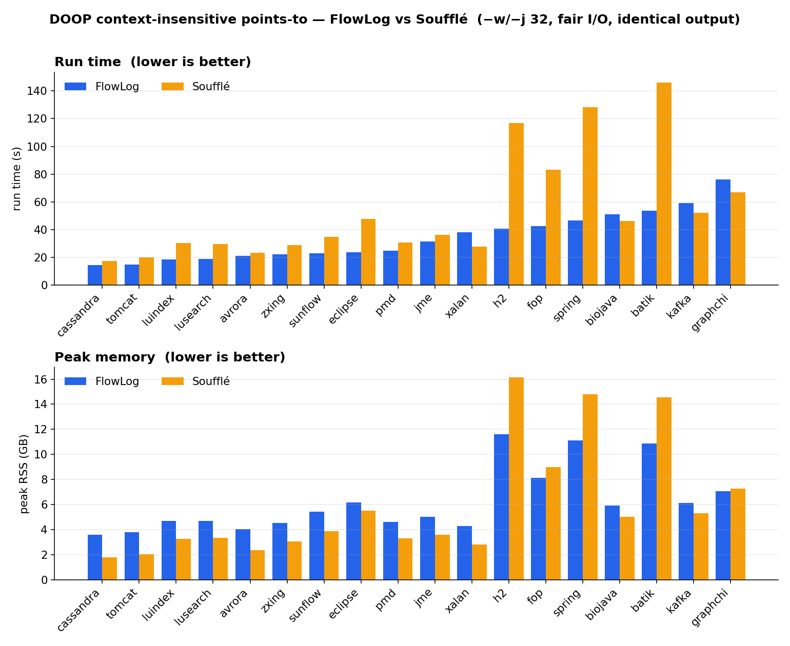
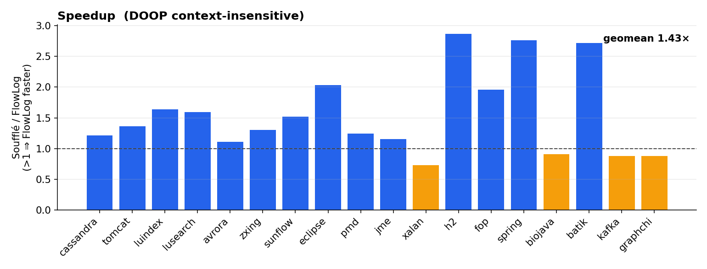
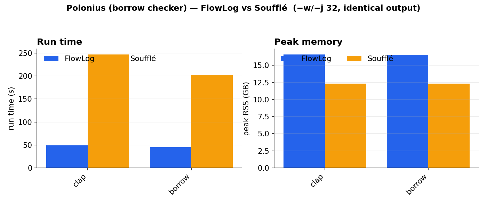

# FlowLog vs Soufflé — latest `main-next`, 32 threads, fair I/O

FlowLog (`flowlog-rs/flowlog` `main-next`, flowlog-build 0.3.3) vs **Soufflé 2.5**
on the two real program-analysis workloads, **`-w/-j 32`** for both engines, with
**identical output** verified per relation.

| | |
|---|---|
| ✅ **Correct** | **0 mismatches.** Every measured (program × dataset) gives **identical per-relation row counts** to Soufflé — `match(21)` for DOOP, `match(20)` for Polonius. |
| ⚡ **DOOP** | FlowLog faster on **14/18** apps, **geomean 1.43×** (0.73–2.87×). It wins biggest on the heavy apps (h2 2.9×, spring/batik 2.7×, fop 2.0×); Soufflé edges it on four light ones (xalan, kafka, graphchi, biojava). |
| ⚡ **Polonius** | FlowLog **~4.7×** faster (clap 5.0×, borrow 4.5×). |
| 🧠 **Memory** | Soufflé is ~19% leaner on small/medium DOOP apps; **FlowLog is leaner on the largest** (h2 11.6 vs 16.5 GB, spring 11.4 vs 15.2, batik 10.9 vs 14.9). |

The 18 DOOP apps in the bar charts span 14–146 s. Two **dense outliers** are kept
out of the bars and shown here instead:

| App | VarPointsTo | FlowLog | Soufflé | verdict |
|---|---:|---:|---:|---|
| **h2o** | 8.3 M | 403.6 s / 23.7 GB | 192.8 s / 30.3 GB | Soufflé 2.1× faster on time; **FlowLog 1.3× leaner**; `match(21)` |
| **jython** | 371 M | completes (~14 min, ~167 GB) | **DNF** (RSS climbs past ~100 GB, no result) | FlowLog only engine that finishes |

## Method

- **Engines, matched threads.** FlowLog compiled to a standalone binary, run `-w 32`.
  Soufflé compiled `souffle -o bin -j 32` and run `bin -j 32` (`-j 32` at *both*
  compile and runtime, as requested).
- **Fair I/O.** Both engines `.output` the full result relations as `.csv`; only the
  **run** is timed (compile excluded). Peak RSS via `/usr/bin/time -v`. All builds,
  outputs and timing on a fast local disk (`/datasets`).
- **Correctness.** For each (program × dataset) the per-relation `.csv` row counts are
  compared between the two engines (`crosscheck` column in `results.csv`). DOOP's only
  known engine difference — the `ord()` heap-merge *representative* — does not change
  any row count, so `match(N)` ⇒ identical results.
- **Programs.** DOOP context-insensitive points-to is the flattened
  `context-insensitive.flat.dl` (Soufflé components + FlowLog head-aggregates; same
  left-to-right join order, both engines). Polonius is `polonius_str` on Rust
  borrow-check facts. (The hand-written `doop/default.dl` is FlowLog-only — head
  aggregates have no Soufflé equivalent — so the DOOP comparison uses the flat program.)
- Soufflé needs explicit empty `.facts` for the always-empty DOOP relations
  (`Keep*`, `RootCodeElement`, …) that FlowLog infers; these are created per dataset.

## Takeaway

The cross-rule **arrangement-sharing / factoring cleanups** (flowlog PR #157) are
**correctness- and performance-neutral**: FlowLog's output is identical to Soufflé on
every workload, and it remains faster overall — decisively so on the heavy DOOP apps
and on Polonius — while trading a little memory on small inputs for a clear memory win
on the large ones.

Raw numbers: [`results.csv`](results.csv). Plots regenerated by [`plot.py`](plot.py).
