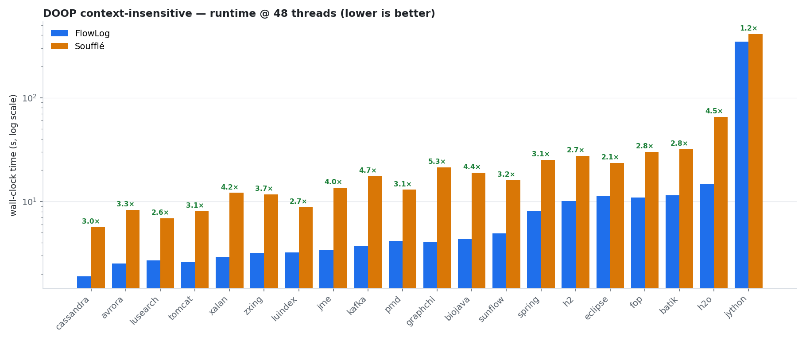
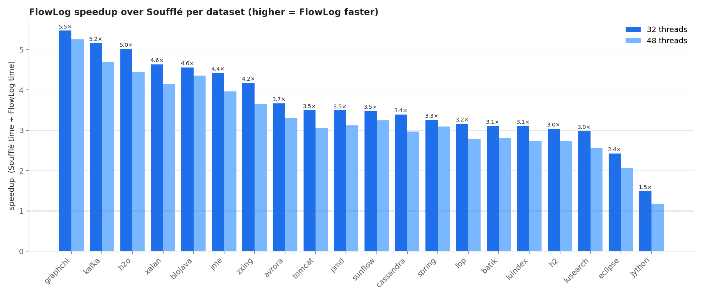
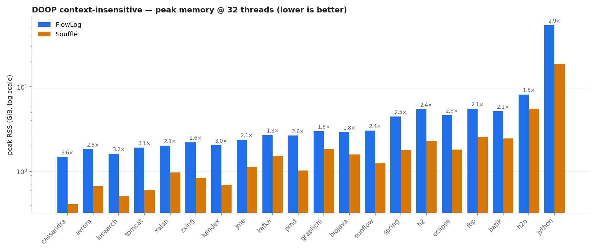
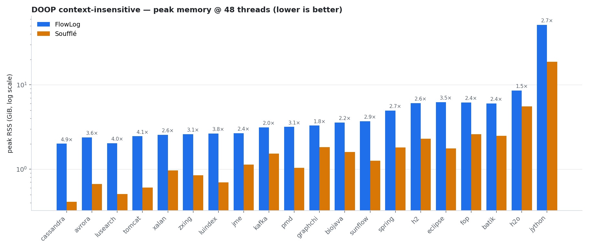

# DOOP context-insensitive — FlowLog vs Soufflé @ 32 and 48 threads

End-to-end run of the DOOP context-insensitive points-to analysis through both
engines over all 20 DaCapo apps, at two thread counts. **FlowLog is faster than
Soufflé on every app at both thread counts**, trading higher peak memory for the
speed.

> **Why 32 and 48, not 64?** The host has **32 physical cores** (AMD EPYC 7763,
> 2 threads/core → 64 logical). 64 threads oversubscribes the physical cores via
> HyperThreading *and* starves co-resident agents sharing the box — both engines
> run **slower** at 64 than at 32. 48 threads is the "slightly below full
> capacity" point that leaves ~16 logical cores of headroom.

## Runtime

## Speedup (Soufflé ÷ FlowLog, higher = FlowLog faster)

## Peak memory

### Headline

| Threads | Apps | FlowLog wins | Geomean speedup | Speedup range | Median extra memory |
|---|---:|---:|---:|---:|---:|
| 32 | 20 | 20/20 | **3.54×** | 1.5×–5.5× | 2.4× |
| 48 | 20 | 20/20 | **3.16×** | 1.2×–5.3× | 2.7× |

### Per-dataset — 32 threads

| Dataset | FlowLog (s) | Soufflé (s) | Speedup | FlowLog RSS (GiB) | Soufflé RSS (GiB) | FlowLog mem cost |
|---|---:|---:|---:|---:|---:|---:|
| cassandra | 1.49 | 5.05 | **3.39×** | 1.48 | 0.41 | 3.6× |
| avrora | 2.12 | 7.77 | **3.67×** | 1.84 | 0.67 | 2.8× |
| lusearch | 2.14 | 6.37 | **2.98×** | 1.62 | 0.51 | 3.2× |
| tomcat | 2.18 | 7.63 | **3.50×** | 1.91 | 0.61 | 3.1× |
| xalan | 2.44 | 11.30 | **4.63×** | 2.03 | 0.97 | 2.1× |
| zxing | 2.62 | 10.94 | **4.18×** | 2.20 | 0.84 | 2.6× |
| luindex | 2.65 | 8.23 | **3.11×** | 2.05 | 0.69 | 3.0× |
| jme | 2.78 | 12.29 | **4.42×** | 2.36 | 1.13 | 2.1× |
| kafka | 3.25 | 16.77 | **5.16×** | 2.68 | 1.53 | 1.8× |
| pmd | 3.43 | 11.97 | **3.49×** | 2.65 | 1.03 | 2.6× |
| graphchi | 3.68 | 20.13 | **5.47×** | 2.99 | 1.82 | 1.6× |
| biojava | 3.90 | 17.77 | **4.56×** | 2.93 | 1.59 | 1.8× |
| sunflow | 4.25 | 14.78 | **3.48×** | 3.03 | 1.26 | 2.4× |
| spring | 7.10 | 23.11 | **3.25×** | 4.45 | 1.79 | 2.5× |
| h2 | 8.56 | 26.00 | **3.04×** | 5.43 | 2.29 | 2.4× |
| eclipse | 8.96 | 21.74 | **2.43×** | 4.64 | 1.81 | 2.6× |
| fop | 9.07 | 28.65 | **3.16×** | 5.51 | 2.56 | 2.1× |
| batik | 9.61 | 29.85 | **3.11×** | 5.14 | 2.45 | 2.1× |
| h2o | 12.85 | 64.41 | **5.01×** | 8.10 | 5.51 | 1.5× |
| jython | 285.52 | 424.90 | **1.49×** | 53.69 | 18.66 | 2.9× |

### Per-dataset — 48 threads

| Dataset | FlowLog (s) | Soufflé (s) | Speedup | FlowLog RSS (GiB) | Soufflé RSS (GiB) | FlowLog mem cost |
|---|---:|---:|---:|---:|---:|---:|
| cassandra | 1.90 | 5.63 | **2.96×** | 2.00 | 0.41 | 4.9× |
| avrora | 2.52 | 8.31 | **3.30×** | 2.38 | 0.67 | 3.6× |
| lusearch | 2.69 | 6.88 | **2.56×** | 2.03 | 0.50 | 4.0× |
| tomcat | 2.63 | 8.03 | **3.05×** | 2.45 | 0.61 | 4.1× |
| xalan | 2.91 | 12.09 | **4.15×** | 2.56 | 0.97 | 2.6× |
| zxing | 3.20 | 11.69 | **3.65×** | 2.60 | 0.85 | 3.1× |
| luindex | 3.22 | 8.83 | **2.74×** | 2.65 | 0.70 | 3.8× |
| jme | 3.42 | 13.54 | **3.96×** | 2.67 | 1.13 | 2.4× |
| kafka | 3.75 | 17.58 | **4.69×** | 3.12 | 1.53 | 2.0× |
| pmd | 4.15 | 12.97 | **3.13×** | 3.17 | 1.04 | 3.1× |
| graphchi | 4.04 | 21.22 | **5.25×** | 3.28 | 1.82 | 1.8× |
| biojava | 4.34 | 18.91 | **4.36×** | 3.58 | 1.59 | 2.2× |
| sunflow | 4.94 | 16.02 | **3.24×** | 3.69 | 1.26 | 2.9× |
| spring | 8.13 | 25.14 | **3.09×** | 4.95 | 1.81 | 2.7× |
| h2 | 10.06 | 27.56 | **2.74×** | 6.07 | 2.30 | 2.6× |
| eclipse | 11.37 | 23.48 | **2.07×** | 6.22 | 1.76 | 3.5× |
| fop | 10.86 | 30.14 | **2.78×** | 6.19 | 2.59 | 2.4× |
| batik | 11.42 | 32.03 | **2.80×** | 6.03 | 2.49 | 2.4× |
| h2o | 14.65 | 65.27 | **4.46×** | 8.54 | 5.52 | 1.5× |
| jython | 347.16 | 410.57 | **1.18×** | 51.32 | 18.76 | 2.7× |

## Reading the results

- **Speed:** FlowLog wins all 20/20 apps at both thread counts — geomean **3.54×**
  (32t) and **3.16×** (48t). Strongest on `graphchi` (5.5×), `kafka` (5.2×),
  `h2o` (5.0×); weakest on `jython` (1.5×), the giant outlier (VarPointsTo runs
  into the hundreds of millions; FlowLog 286 s vs Soufflé 425 s).
- **32t beats 48t for both engines.** Going from 32 → 48 threads on a 32-physical-core
  box adds HT contention, so both engines get *slower*, and FlowLog's speedup
  narrows slightly (3.54× → 3.16×). This is a property of the host, not the engines.
- **Memory is FlowLog's cost.** FlowLog's differential-dataflow indices use
  **~1.5–4× more peak RSS** than Soufflé (median 2.4× @ 32t). At 48 threads the
  memory gap widens (more worker-local arrangements). `jython` peaks at ~53 GiB
  (FlowLog) vs ~19 GiB (Soufflé).

## Run conditions

| Field | Value |
|---|---|
| Host | `flowlog-west2` — AMD EPYC 7763, 32 physical cores / 64 logical |
| FlowLog SHA | `a13a41590b1bd5b6c396d87f4dc2011568666fde` (`main-next`; == `feat/doop-end-to-end`, PR #130) |
| FlowLog program | `example/program_analysis/doop.dl` (652 lines, 8 `.plan`, 26 `.printsize`) |
| Soufflé | 2.5, **compiled** mode |
| Soufflé program | `programs/oracle/souffle/doop.dl` (matched: 8 `.plan`, 26 `.printsize`) |
| Threads | 32 and 48 for **both** engines; Soufflé gets `-j N` at **both** compile and run time (parallel `pfor`, linked against `libgomp`) |
| FlowLog string handling | `--str-intern` (default in `scripts/engines/compiler.sh`) |
| Repetitions | 1 timed run per (engine × dataset × thread count); runs sequential for clean peak-RSS |
| Measurement | `/usr/bin/time -v` → wall clock + max RSS; end-to-end (load + compute + printsize) |
| Datasets | 20 DaCapo 23.11-MR2-chopin apps from `/datasets/facts/<app>` |
| Correctness gate | batik cross-checked — all 26 `.printsize` relations identical (VarPointsTo 37,237,353 on both) |

See [`doop-run-info.txt`](doop-run-info.txt) for exact commands. Raw long-format
data in [`doop-results-raw.csv`](doop-results-raw.csv); curated wide table in
[`doop-results.csv`](doop-results.csv). Regenerate the charts with
`python3 make_plots.py doop-results-raw.csv .`.

> Single-rep note: timings are one run each (not median-of-5), so ±a few percent
> is expected on the small apps. The relative picture (FlowLog 3–5× faster, ~2–3×
> heavier; 32t > 48t on this box) is stable and matches the prior median-of-5
> snapshot in `results/final-runs/doop`.
