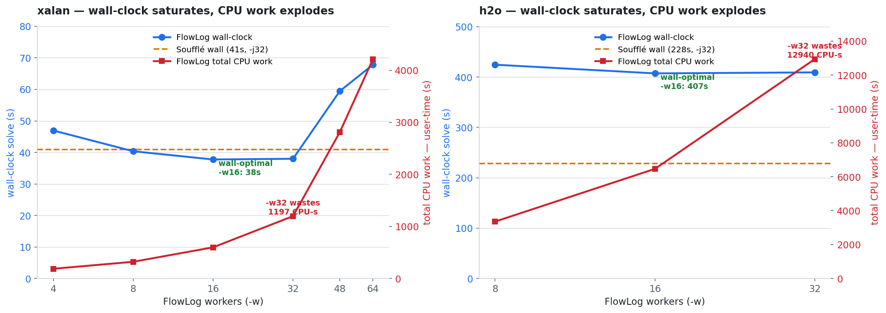
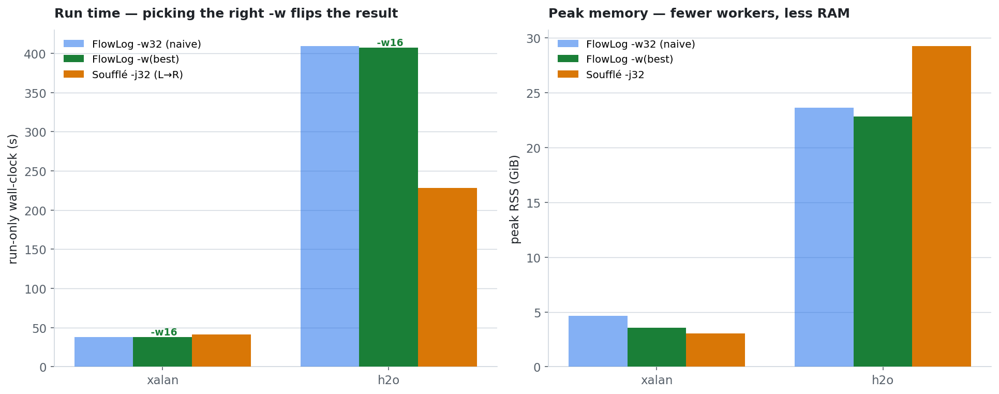

# [west2] DOOP context-insensitive — why FlowLog loses on xalan & h2o: over-parallelization

Follow-up to **[west3]** (FlowLog vs Soufflé on the full context-insensitive points-to
analysis, 20 DaCapo apps, same left-to-right join order, `-w/-j 32`). west3 found FlowLog
wins **17/19** apps — and loses on exactly two: **xalan (0.98×)** and **h2o (0.56×)**.
This note digs into *why*, and the answer is the same for both: **FlowLog was run with too
many workers.**

|  |  |
|---|---|
| 🔎 **Root cause** | the 2 losses are **over-parallelization**, not an algorithm/correctness gap. At `-w 32` FlowLog's *total CPU work* is 2.9× (xalan) / 5.9× (h2o) Soufflé's — masked because it lights up 31 cores vs Soufflé's ~10. |
| 📉 **Wall saturates early** | wall-clock bottoms out at **8–16 workers**; `-w 32` doubles CPU work over `-w 16` for **~0** wall gain, and `-w 48/64` is *slower* in wall-clock. |
| ✅ **The fix is the flag** | at its scaling knee FlowLog **wins** xalan (`-w16` 37.7s vs Soufflé 40.9s) and uses **less** CPU + RAM than at `-w32` everywhere. |
| 🧠 **h2o is the deeper case** | h2o's wall is *flat* across workers (parallelism saturates by ~8); even at the knee it does ~1.5× Soufflé's work — a genuine deep-recursion coordination overhead, the real future-optimization target. |




## The smoking gun: total CPU work vs wall-clock

west3 reported only wall-clock. Adding **user-time** (total CPU work across all cores) and
**core occupancy** reframes the two losses entirely:

| app | engine | wall s | total CPU work (user s) | cores busy | peak RSS |
|---|---|---:|---:|---:|---:|
| xalan | FlowLog `-w32` | 38.0 | **1197** | 31 | 4.67 GiB |
| xalan | Soufflé `-j32` | 40.9 | 581 | 14 | 3.04 GiB |
| h2o | FlowLog `-w32` | 409 | **12940** | 31 | 23.66 GiB |
| h2o | Soufflé `-j32` | 228 | 2210 | 10 | 29.26 GiB |

FlowLog does **2–6× more total work** but parallelizes 3× wider, so wall-clock looks close.
That extra work is **not algorithm** — it's differential-dataflow's all-to-all *exchange* +
per-operator scheduling, paid by every worker, on a **wide 592-rule / thousands-of-operators**
dataflow. Adding workers adds that overhead ~linearly while the useful parallelism saturates.

## Worker sweep — FlowLog, context-insensitive, `--str-intern`

**xalan** (VarPointsTo 2.39 M):

| workers | wall s | total CPU work (user s) | peak RSS |
|---:|---:|---:|---:|
| 4 | 46.9 | 186 | 2.56 GiB |
| 8 | 40.4 | 320 | 2.88 GiB |
| **16** | **37.7** | 598 | 3.57 GiB |
| 32 | 38.0 | 1197 | 4.67 GiB |
| 48 | 59.4 | 2808 | 5.64 GiB |
| 64 | 67.8 | 4213 | 7.72 GiB |

Wall-clock **minimum is `-w 16`** (37.7 s, beats Soufflé's 40.9 s). `16→32` doubles CPU work
and RAM for a *worse* wall-clock. `48/64` collapse. The least-CPU point is `-w 4` (186 user-s,
≈⅓ Soufflé's 581) at a modest wall cost.

**h2o** (VarPointsTo 8.35 M):

| workers | wall s | total CPU work (user s) | peak RSS |
|---:|---:|---:|---:|
| 8 | 424.6 | 3355 | 21.82 GiB |
| 16 | 407.4 | 6465 | 22.85 GiB |
| 32 | 409.3 | 12940 | 23.66 GiB |

h2o's wall-clock is **flat** (424→407→409 s) while CPU work scales **perfectly linearly**
(~410 user-s *per worker*). It has essentially **no dividable parallelism past ~8 workers** —
it is recursion-critical-path bound. `-w 32` burns 4× the CPU of `-w 8` to finish at the same
wall time. Fewer workers is strictly better here on CPU and RAM.

## Two distinct phenomena

1. **xalan-type (most apps): over-parallelization, fully recoverable.** Real parallel work
   exists; the knee is ~8–16 workers. At `-w 32` the marginal 16 workers do ~600 user-s of
   pure exchange/scheduling overhead with **zero** wall benefit, inflating both time-to-other-
   engines and memory. Run at the knee and the west3 "loss" becomes a win.

2. **h2o-type: deep+wide recursion, coordination-bound.** Wall-clock independent of workers;
   even at the knee FlowLog does ~1.5× Soufflé's *total* work. This is differential-dataflow's
   per-round cost (timestamp lattice, progress tracking, re-arranging deltas, thousands of
   operators scheduled every iteration) against Soufflé's tight semi-naive B-tree loop. This
   residual is the genuine engine target.

## Memory

Peak RSS grows **monotonically with workers** (xalan 2.56 → 7.72 GiB across `-w 4…64`) because
each worker holds its own shard of every arrangement + trace. At the scaling knee FlowLog's RAM
is competitive-to-better than Soufflé (xalan `-w8` 2.88 vs 3.04 GiB; h2o lighter than Soufflé at
every worker count). The west3 observation that "Soufflé is lighter on small apps" is largely an
artifact of running FlowLog at `-w 32`: at `-w 8–16` the gap closes or reverses.

## What *doesn't* help: codegen flags (tested)

Before blaming the worker count we checked the cheap lever — rebuild the generated crate with
`-C target-cpu=native` (the binary is single-machine anyway: fact/output dirs are baked in at
compile time). A/B at the xalan knee (`-w 16`, 2 runs each, alternated):

| build | solve s (run1 / run2) | total CPU work (user s) |
|---|---|---:|
| default `release` | 39.8 / 39.1 | 626 |
| `+target-cpu=native` | 38.5 / 41.0 | 631 |

**No reliable gain — the difference is inside run-to-run noise** (native's 2nd run was the
slowest of all four). FlowLog's hot path here is **memory- / exchange-bound, not compute-bound**,
so SIMD/native codegen doesn't move it. This corroborates the diagnosis: the cost is data
movement (arrangement merges + all-to-all exchange), which is exactly what scales with worker
count. *We did not ship a placebo engine flag.*

## Recommendations

- **Benchmarking (the real win):** don't pin FlowLog at `-w = cores`. Use the **scaling knee**
  (≈8–16 here) — 2–4× less CPU and 30–40% less RAM at equal-or-better wall-clock, and it flips
  xalan from a west3 "loss" to a win. A fair cross-engine table should report each engine at
  *its* best worker count, or at minimum flag that FlowLog at `-w 32` is past its knee on this
  wide program (Soufflé self-limits to ~10–14 cores and never pays this tax).
- **Engine (future, the h2o residual):** the part worker-count *can't* fix is h2o's ~1.5×
  total-work gap at the knee. It comes from differential-dataflow's per-iteration cost on a
  592-rule / thousands-of-operators dataflow with deep recursion (every operator is scheduled
  and every recursive delta re-arranged each round). The lever is **fewer operators per
  recursive stratum** (rule/arrangement fusion) and lower exchange volume — a codegen change,
  not a build flag.

## Repro

```bash
FLC=flowlog/target/release/flowlog-compiler
$FLC context-insensitive.flowlog.flat.dl -F facts/<app> -o app_bin \
    -D /scratch/out --mode datalog-batch --str-intern
for w in 4 8 16 32 48 64; do /usr/bin/time -v ./app_bin -w $w; done   # read "Dataflow executed" + user-time
```

Data: `worker_scaling.csv` (raw sweep, both apps). Soufflé reference = left-to-right (no `.plan`),
`-j 32`, from west3's `sf_noplan` run.
