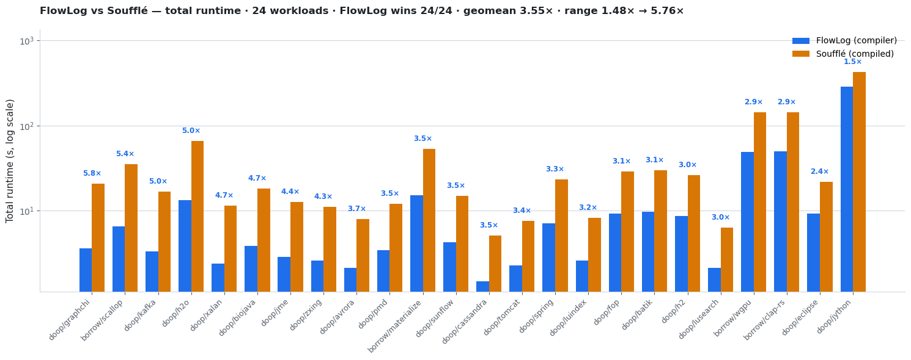
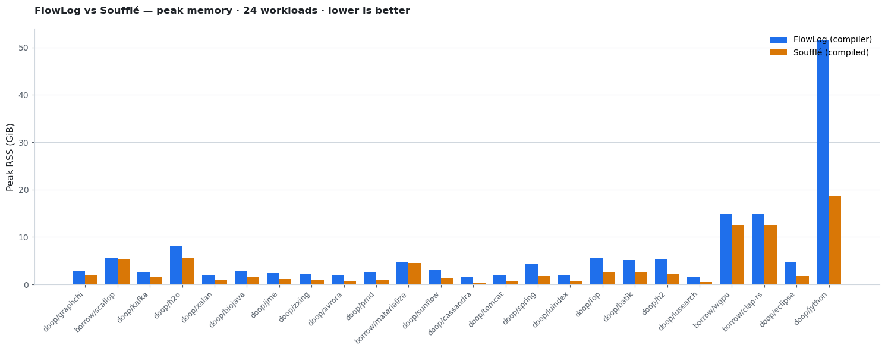

# [west 2] DOOP + Polonius FlowLog vs Souffle snapshot

FlowLog was faster than Souffle on all 24 workloads in this 32-thread run. Each cell below uses the median of 5 successful attempts per engine.

## Run conditions

| Field | Value |
|---|---|
| Host | `flowlog-west2` |
| FlowLog SHA | `20f2aa0a7d5aa3f052ef6fcccb9df40e74ede2d1` |
| Engines | FlowLog compiler vs Souffle compiled mode |
| Threads | 32 for both engines; Souffle gets `-j 32` at compile time and runtime |
| Repetitions | 5 per engine per workload; median total runtime and median peak RSS reported |
| FlowLog string handling | `--str-intern` enabled by default in `scripts/engines/compiler.sh` |
| Dataset cache | Existing `/datasets/facts` cache via `facts/` symlink; runner used `--keep-datasets` |
| Correctness gate | All rows are `match(...)` row-count crosschecks with 5/5 successful runs |

## Headline

| Scope | Workloads | FlowLog wins | Geomean speedup | Speedup range |
|---|---:|---:|---:|---:|
| All | 24 | 24/24 | 3.55x | 1.48x-5.76x |
| DOOP | 20 | 20/20 | 3.55x | 1.48x-5.76x |
| Polonius | 4 | 4/4 | 3.55x | 2.89x-5.38x |

Souffle used less peak RSS on every row; its geomean memory ratio was 0.48x of FlowLog's peak RSS.

## Per-workload results

| Workload | FlowLog total s | Souffle total s | Souffle/FlowLog | FlowLog GiB | Souffle GiB | Crosscheck |
|---|---:|---:|---:|---:|---:|---|
| doop/graphchi | 3.593 | 20.704 | 5.76x | 2.92 | 1.82 | match(26) |
| polonius/scallop | 6.522 | 35.099 | 5.38x | 5.68 | 5.34 | match(20) |
| doop/kafka | 3.301 | 16.652 | 5.04x | 2.65 | 1.53 | match(26) |
| doop/h2o | 13.217 | 65.855 | 4.98x | 8.13 | 5.51 | match(26) |
| doop/xalan | 2.399 | 11.383 | 4.74x | 2.07 | 0.97 | match(26) |
| doop/biojava | 3.862 | 18.097 | 4.69x | 2.93 | 1.59 | match(26) |
| doop/jme | 2.877 | 12.673 | 4.41x | 2.35 | 1.13 | match(26) |
| doop/zxing | 2.580 | 11.018 | 4.27x | 2.19 | 0.84 | match(26) |
| doop/avrora | 2.112 | 7.920 | 3.75x | 1.87 | 0.67 | match(26) |
| doop/pmd | 3.429 | 12.052 | 3.52x | 2.65 | 1.03 | match(26) |
| polonius/materialize | 15.224 | 53.373 | 3.51x | 4.77 | 4.57 | match(20) |
| doop/sunflow | 4.263 | 14.885 | 3.49x | 3.02 | 1.24 | match(26) |
| doop/cassandra | 1.482 | 5.118 | 3.45x | 1.48 | 0.41 | match(26) |
| doop/tomcat | 2.265 | 7.642 | 3.37x | 1.91 | 0.61 | match(26) |
| doop/spring | 7.079 | 23.336 | 3.30x | 4.44 | 1.79 | match(26) |
| doop/luindex | 2.609 | 8.244 | 3.16x | 2.07 | 0.69 | match(26) |
| doop/fop | 9.254 | 28.793 | 3.11x | 5.52 | 2.56 | match(26) |
| doop/batik | 9.653 | 29.994 | 3.11x | 5.10 | 2.46 | match(26) |
| doop/h2 | 8.613 | 26.125 | 3.03x | 5.43 | 2.29 | match(26) |
| doop/lusearch | 2.136 | 6.364 | 2.98x | 1.63 | 0.51 | match(26) |
| polonius/wgpu | 49.238 | 143.331 | 2.91x | 14.77 | 12.43 | match(20) |
| polonius/clap-rs | 49.693 | 143.451 | 2.89x | 14.86 | 12.43 | match(20) |
| doop/eclipse | 9.299 | 21.888 | 2.35x | 4.62 | 1.75 | match(26) |
| doop/jython | 286.803 | 425.288 | 1.48x | 51.42 | 18.57 | match(26) |

## Files

- `combined-results.csv` - all 24 rows used by the plots.
- `doop-results.csv`, `polonius-results.csv` - raw cross-engine CSVs by suite.
- `doop-run-info.txt`, `polonius-run-info.txt` - reproducibility manifests emitted by the runner.

Note: the crosscheck compares per-relation row counts reported by both engines; it does not byte-compare tuple payloads.
