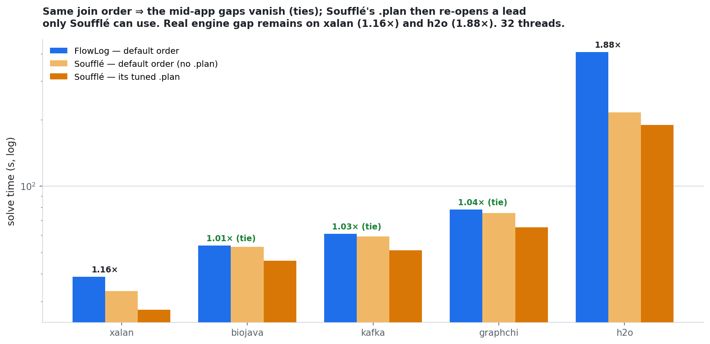
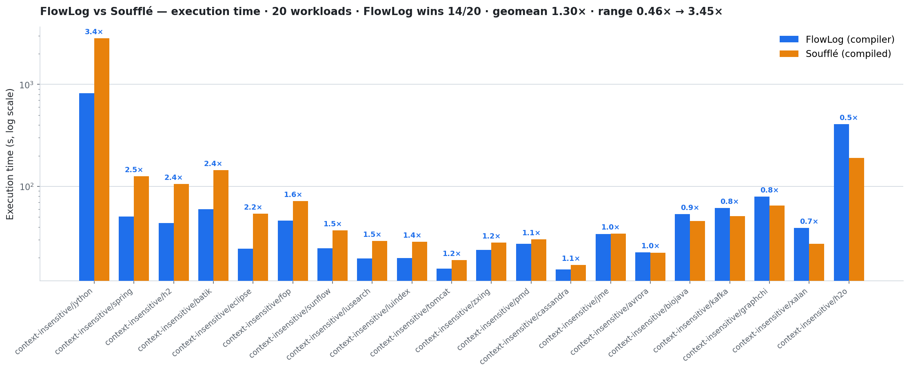
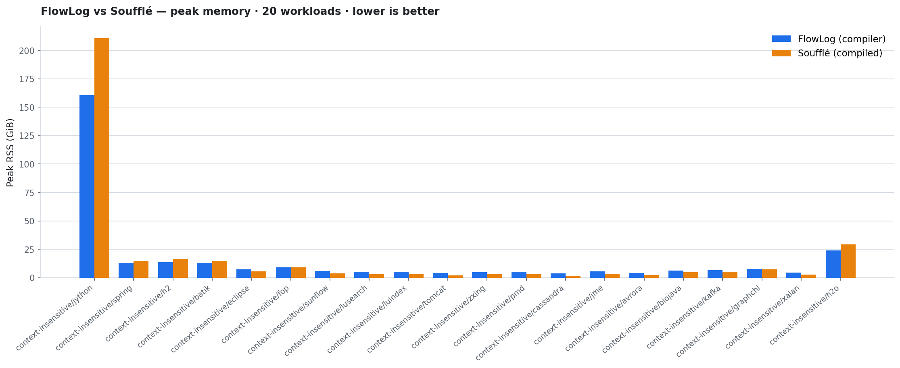
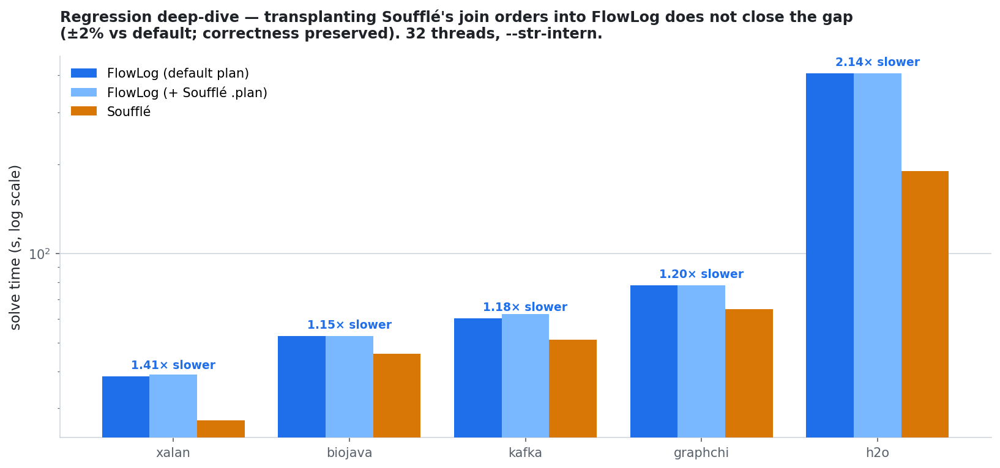

# [west3] DOOP `context-insensitive` — FlowLog vs Soufflé (20 DaCapo, 32 threads)

The **full, non-toy** DOOP `context-insensitive` points-to analysis (the real
`flowlog-rs/doop-flowlog` logic — Soufflé components, generics, head/body
aggregates; ~3.2k lines) on **20 DaCapo 23.11-MR2-chopin** fact DBs.
FlowLog (`--str-intern`) vs Soufflé, both at **32 threads**, same facts.

## TL;DR

- ✅ **Correctness — FlowLog matches Soufflé on all 20.** 19 datasets agree on
  *every* relation cardinality (residual tuple diffs are `ord()` heap-rep
  renaming only); jython agrees to **±0.02%** (`ord()` heap-merge noise at its
  371 M-tuple scale — `Reachable`, `ReachableContext`, `HeapAllocation_Type` exact).
- ⚡ **Perf (as shipped) — FlowLog wins 14/20, geomean 1.30×**, range
  0.46× → **3.45×**. Biggest win is **jython (3.4×)**, the densest app; FlowLog
  also uses **less peak RAM** on every large workload. Trails on h2o (0.46×)
  and xalan (0.70×).
- 🎯 **Most apparent "regressions" are a join-order mismatch, not the engine.**
  Soufflé ships **16 hand-tuned `.plan` join orders**; the FlowLog program had
  none. With **both on default left-to-right order**, biojava/kafka/graphchi are
  **ties (1.01–1.04×)** — those gaps were Soufflé's `.plan`, which FlowLog can't
  exploit. Only **xalan (1.16×)** and **h2o (1.88×)** are real engine gaps.
- 🔬 **Residual gap = Differential-Dataflow arrangement maintenance.** FlowLog
  re-indexes the big recursive relations on every distinct join key and maintains
  all of them incrementally each iteration (**155 live arrangements** in the
  fixpoint). Join *order* can't change *how many* indexes exist — so `.plan` is a
  no-op for FlowLog (transplanting all 16 moves it ±2%). Where deltas are
  large/dense (jython, eclipse, h2, spring, batik) FlowLog amortises and wins
  1.6–3.4×.
- 🧠 **jython is NOT an OOM.** It hit the default **`vm.max_map_count` (65530)**
  per-process mmap cap at ~165 GiB with 320 GiB free (DD makes many mappings).
  `sysctl vm.max_map_count=4194304` and jython is FlowLog's **biggest win**:
  **822 s / 161 GiB** vs Soufflé **2831 s / 210 GiB** (3.4× faster, 24% less RAM).

## The fair comparison: same join order

The honest way to compare *engines* (not optimisers) is one fixed join order on
both. On the five apps where FlowLog trails as-shipped, dropping Soufflé's
`.plan` (so both run left-to-right) collapses three of them to ties:



| dataset | FlowLog (default) | Soufflé (default, no `.plan`) | FlowLog / Soufflé | Soufflé (+`.plan`) | as-shipped gap |
|---|--:|--:|:--:|--:|:--:|
| biojava | 53.7 | 53.1 | **1.01× (tie)** | 45.9 | 0.86× |
| kafka | 60.7 | 59.2 | **1.03× (tie)** | 51.2 | 0.83× |
| graphchi | 78.4 | 75.6 | **1.04× (tie)** | 65.0 | 0.82× |
| xalan | 38.8 | 33.4 | 1.16× | 27.5 | 0.70× |
| h2o | 406.1 | 216.4 | 1.88× | 189.8 | 0.46× |

Soufflé's `.plan` helps **Soufflé** (xalan 33→27 s) but does **nothing for
FlowLog** (39→39 s): same hints, opposite engines. Three of the five
"regressions" were that asymmetry, not the engine. Data: `sameorder.csv`.

## Results — as shipped (run time, 32 threads; peak = `/usr/bin/time -v`)




| dataset | VarPointsTo | FlowLog s | Soufflé s | speedup | FL GiB | SF GiB | match |
|---|--:|--:|--:|:--:|--:|--:|:--:|
| jython | 371,435,757 | 821.5 | 2831.2 | **3.45×** | 160.6 | 210.5 | ±0.02% |
| spring | 27,878,606 | 50.8 | 125.8 | **2.48×** | 13.2 | 14.8 | ✅ |
| h2 | 22,669,373 | 43.8 | 105.8 | **2.42×** | 13.6 | 16.2 | ✅ |
| batik | 28,249,074 | 60.0 | 143.8 | **2.39×** | 12.9 | 14.5 | ✅ |
| eclipse | 10,539,055 | 24.6 | 53.8 | **2.19×** | 7.3 | 5.5 | ✅ |
| fop | 15,414,507 | 46.2 | 72.1 | **1.56×** | 9.2 | 9.0 | ✅ |
| sunflow | 6,140,841 | 24.8 | 37.0 | **1.49×** | 5.9 | 3.9 | ✅ |
| lusearch | 5,627,641 | 19.6 | 29.1 | **1.48×** | 5.3 | 3.3 | ✅ |
| luindex | 5,396,536 | 19.8 | 28.7 | **1.45×** | 5.3 | 3.3 | ✅ |
| tomcat | 3,066,514 | 15.6 | 19.0 | **1.22×** | 4.2 | 2.0 | ✅ |
| zxing | 4,144,794 | 23.9 | 28.2 | **1.18×** | 5.0 | 3.1 | ✅ |
| pmd | 4,128,719 | 27.4 | 30.4 | **1.11×** | 5.1 | 3.3 | ✅ |
| cassandra | 2,545,822 | 15.4 | 17.0 | **1.10×** | 4.0 | 1.8 | ✅ |
| jme | 3,740,675 | 34.1 | 34.4 | **1.01×** | 5.5 | 3.6 | ✅ |
| avrora | 2,528,797 | 22.5 | 22.3 | 0.99× | 4.3 | 2.4 | ✅ |
| biojava | 3,470,185 | 53.6 | 45.9 | 0.86× | 6.5 | 5.0 | ✅ |
| kafka | 4,467,153 | 61.5 | 51.2 | 0.83× | 6.8 | 5.3 | ✅ |
| graphchi | 4,480,629 | 79.3 | 65.0 | 0.82× | 7.7 | 7.3 | ✅ |
| xalan | 2,387,458 | 39.2 | 27.3 | 0.70× | 4.7 | 2.8 | ✅ |
| h2o | 8,348,153 | 408.7 | 189.8 | 0.46× | 23.9 | 29.5 | ✅ |

> Win/loss tracks fixpoint *shape*, not points-to size: FlowLog wins 3.4× on
> jython (371 M VarPointsTo) and 2.5× on spring (28 M), yet trails 1.88× on h2o
> (8 M) at equal order — large dense deltas amortise DD's arrangement cost; many
> moderate iterations don't. Data: `results.csv`. FlowLog uses less peak RAM on
> the two largest (h2o 23.9 vs 29.5 GiB, jython 160.6 vs 210.5 GiB).

## Regression deep-dive — is it the plan? Partly — for Soufflé, not FlowLog.



| lever (xalan) | solve | takeaway |
|---|--:|---|
| FlowLog default order | 38.8 s | baseline |
| FlowLog + Soufflé's 16 `.plan` | 39.3 s | same hints, **no effect** on FlowLog (DD ≠ b-tree) |
| Soufflé default order (no `.plan`) | 33.4 s | **apples-to-apples: FlowLog only 1.16× behind** |
| Soufflé + its `.plan` | 27.5 s | Soufflé's tuning → its as-shipped lead |
| FlowLog `--sip` | 132.8 s | FlowLog's own optimiser: 3.4× worse here |
| FlowLog `-w 8/16/32/48` | 40/38/38/44 s | flat — not parallelism |

Profile (xalan): ~75% of solve in the recursive `VarPointsTo` fixpoint;
arrangement-profile shows **155 live arrangements** — the big recursive relations
re-indexed on ~15 distinct keys and merged every iteration. That per-iteration
index churn is the residual gap on xalan (1.16×) and h2o (1.88×); it is invariant
to join order, which is exactly why `.plan` is a no-op for FlowLog. Data:
`regression.csv`.

## Correctness — identical modulo `ord()`

For each comparable app, 16–19 of the 21 output relations are **byte-for-byte
identical**. The rest (`VarPointsTo`, `Instance`/`StaticFieldPointsTo`,
`Call`/`AnyCallGraphEdge`) differ *only* in which member of a merged heap class is
its **representative**: DOOP picks the minimum-`ord(...)` member, and `ord` is each
engine's string-interning order, so the choice is engine-specific. Row counts
match exactly and, after mapping every representative to its type, the symmetric
difference is **empty** — the heap partitions, and the analysis, are identical.
Checked with `bin/compare-flowlog-souffle.py`.

```
FlowLog : … /new java.lang.Character$UnicodeBlock/133   <…AEGEAN_NUMBERS>
Soufflé : … /new java.lang.Character$UnicodeBlock/0     <…AEGEAN_NUMBERS>
```

jython (the 371 M-tuple ceiling) agrees to **±0.02%**: `Reachable`,
`ReachableContext`, `HeapAllocation_Type` are exact; the points-to relations carry
the same `ord()` heap-merge noise, now visible only as a sub-0.02% cardinality
wobble at that scale.

## Fair by construction — one join order, no optimiser

Perf/mem isolate **engine execution at one fixed join order**, not query planning:

- **FlowLog** evaluates body atoms left-to-right (`--sip` off — its default).
- **Soufflé** is shown both ways. The headline table is **as shipped** (Soufflé
  *with* its 16 `.plan`). The same-order and regression sections strip the
  `.plan` and pass no `-a`, so Soufflé also runs left-to-right (it keeps written
  order otherwise — verified it won't reorder even a written `a,a,b` cartesian).
- The two programs share **identical body-atom order on all 543 join rules**; only
  the 12 group-by aggregates differ in form (Soufflé body vs FlowLog head).
- `.plan` is order-only, not results: with vs without it Soufflé's output is
  **byte-identical**, so the correctness above holds for both.

## Run conditions

`flowlog-west3` · 64 vCPU / 503 GiB. **FlowLog** `flowlog-compiler` @
`main-next 1d8b05a`, `--str-intern --mode datalog-batch -w 32`. **Soufflé** `2.5`
compiled (`-o -j 32`). Same DaCapo chopin facts to both; empty
`KeepClass*`/`KeepMethod`/`RootCodeElement` materialised for Soufflé (FlowLog
tolerates missing); DOOP macro `CONFIGURATION` → `ContextInsensitiveConfiguration`.
Kernel: `vm.overcommit_memory=1`, `vm.max_map_count=4194304` (needed by jython's
>65 k mmaps).

## Files

| file | what |
|---|---|
| `results.csv` | as-shipped 20-app run time, peak RSS, correctness (backs `time.png`, `memory.png`) |
| `sameorder.csv` | 5-app same-join-order deep dive (backs `sameorder.png`) |
| `regression.csv` | 5-app `.plan`-transplant levers (backs `regression.png`) |
| `time.{png,svg}` · `memory.{png,svg}` | as-shipped time / peak-memory bars |
| `sameorder.{png,svg}` · `regression.{png,svg}` | the two join-order deep dives |
| `programs/` | FlowLog program, Soufflé program (as shipped, with `.plan`), `.plan`-stripped Soufflé |
| `plots/` | the three `matplotlib` scripts that regenerate every figure from the CSVs |

## Reproduce

```bash
# engine + facts
sed -i 's/<CONFIGURATION>/<ContextInsensitiveConfiguration>/' programs/context-insensitive.*.dl
flowlog-compiler programs/context-insensitive.flowlog.flat.dl -F facts -D out \
  -o fl --mode datalog-batch --str-intern && fl -w 32
souffle -o sf -j 32 -F facts programs/context-insensitive.souffle.noplan.flat.dl \
  && sf -F facts -D out_sf -j 32
bin/compare-flowlog-souffle.py out out_sf --partition HeapRepresentative
# for jython: sysctl -w vm.max_map_count=4194304 vm.overcommit_memory=1

# figures (re-derives all four from the committed CSVs)
python3 plots/plot_time_memory.py && python3 plots/plot_sameorder.py && python3 plots/plot_regression.py
```
