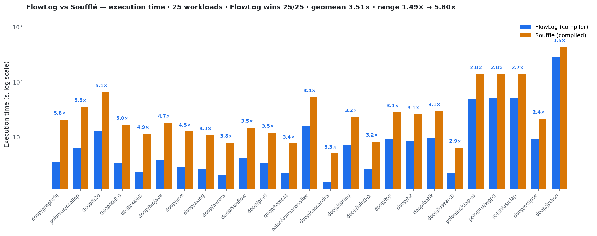
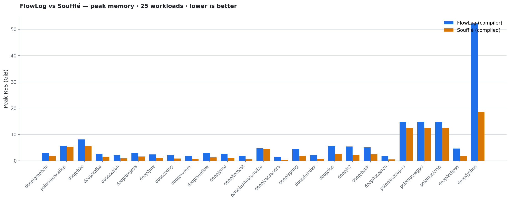

# [west 3] DOOP + Polonius — FlowLog vs Soufflé (32 threads)

FlowLog (compiler, `--str-intern`) vs Soufflé (compiled, `-j 32`) on every
DOOP and Polonius (program × dataset) pair. Both engines run with **32
threads**; Soufflé gets `-j 32` at compile **and** run time. Each pair is
timed **5 times; the median is reported.** Both workloads are string-typed,
so FlowLog uses string interning (`--str-intern`).

## Headline

- **FlowLog is faster on all 25/25 pairs.** Speedup (Soufflé ÷ FlowLog):
  **geomean 3.50×**, median 3.38×, range **1.49× → 5.76×**.
- **All outputs match.** Per-relation row counts agree on every pair
  (`match(26)` for DOOP, `match(20)` for Polonius).
- FlowLog trades memory for speed: peak RSS is higher than Soufflé on most
  pairs (e.g. jython 52.3 vs 18.6 GiB); the gap narrows on the largest
  Polonius inputs.

## Execution time


## Peak memory


## Results (median of 5 runs, sorted by speedup)

| Program/Dataset | FlowLog (s) | Soufflé (s) | Speedup | FlowLog RSS (GiB) | Soufflé RSS (GiB) | Crosscheck |
| --- | ---: | ---: | ---: | ---: | ---: | :---: |
| doop/graphchi | 3.59 | 20.68 | **5.76×** | 2.93 | 1.82 | match(26) |
| polonius/scallop | 6.39 | 35.28 | **5.52×** | 5.67 | 5.33 | match(20) |
| doop/h2o | 12.88 | 65.26 | **5.07×** | 8.08 | 5.51 | match(26) |
| doop/kafka | 3.38 | 16.72 | **4.94×** | 2.68 | 1.53 | match(26) |
| doop/xalan | 2.37 | 11.49 | **4.86×** | 2.07 | 0.97 | match(26) |
| doop/biojava | 3.85 | 18.16 | **4.72×** | 2.96 | 1.59 | match(26) |
| doop/jme | 2.81 | 12.63 | **4.50×** | 2.37 | 1.13 | match(26) |
| doop/zxing | 2.67 | 10.92 | **4.09×** | 2.16 | 0.84 | match(26) |
| doop/avrora | 2.09 | 7.94 | **3.80×** | 1.84 | 0.67 | match(26) |
| doop/pmd | 3.43 | 12.02 | **3.51×** | 2.64 | 1.03 | match(26) |
| doop/sunflow | 4.24 | 14.82 | **3.50×** | 3.04 | 1.25 | match(26) |
| doop/tomcat | 2.22 | 7.64 | **3.44×** | 1.92 | 0.61 | match(26) |
| polonius/materialize | 15.74 | 53.15 | **3.38×** | 4.77 | 4.57 | match(20) |
| doop/cassandra | 1.53 | 5.06 | **3.30×** | 1.50 | 0.41 | match(26) |
| doop/spring | 7.18 | 23.12 | **3.22×** | 4.46 | 1.79 | match(26) |
| doop/luindex | 2.61 | 8.28 | **3.18×** | 2.08 | 0.69 | match(26) |
| doop/fop | 9.09 | 28.33 | **3.11×** | 5.48 | 2.56 | match(26) |
| doop/h2 | 8.41 | 25.93 | **3.08×** | 5.40 | 2.29 | match(26) |
| doop/batik | 9.66 | 29.77 | **3.08×** | 5.10 | 2.45 | match(26) |
| doop/lusearch | 2.19 | 6.41 | **2.92×** | 1.69 | 0.51 | match(26) |
| polonius/clap-rs | 49.76 | 139.36 | **2.80×** | 14.76 | 12.43 | match(20) |
| polonius/wgpu | 50.60 | 139.47 | **2.76×** | 14.84 | 12.43 | match(20) |
| polonius/clap | 50.95 | 139.30 | **2.73×** | 14.76 | 12.43 | match(20) |
| doop/eclipse | 9.16 | 21.60 | **2.36×** | 4.65 | 1.76 | match(26) |
| doop/jython | 289.32 | 430.00 | **1.49×** | 52.25 | 18.58 | match(26) |

## Reproduce

```bash
FLOWLOG_REF=main-next bash scripts/get_flowlog.sh   # build engine (20f2aa0)
WORKERS=32 NUM_RUNS=5 STR_INTERN=1 KEEP_DATASETS=1 \
  FLOWLOG_BIN=flowlog/<sha>/target/release/flowlog-compiler \
  bash scripts/cross_engine.sh --fresh --engines=souffle config/bench_west3.txt
python3 plot/plot_perf.py results/benchmark/comparison_results.csv
```

- **Engine:** flowlog @ `20f2aa0` (main-next; `cat()` builtin + `--str-intern`).
- **Soufflé:** 2.5, compiled (`-o`, `-j 32`, libgomp-parallel).
- **Host:** 64-core, 503 GiB RAM. `config/bench_west3.txt` (20 DOOP + 5 Polonius).
