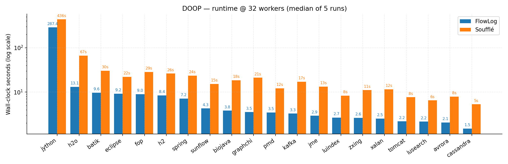
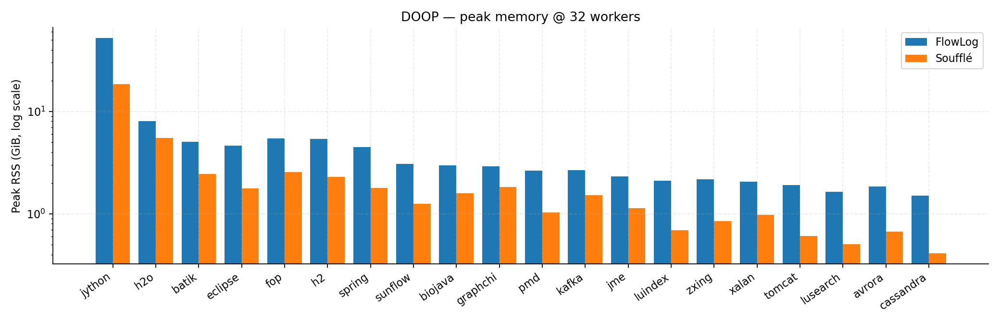
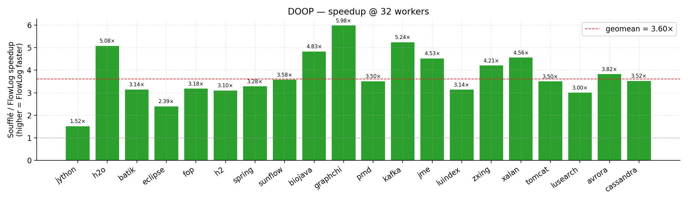
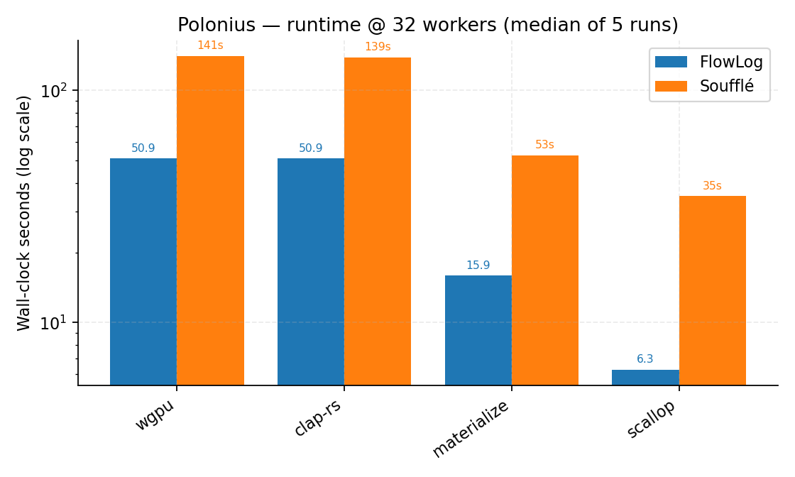
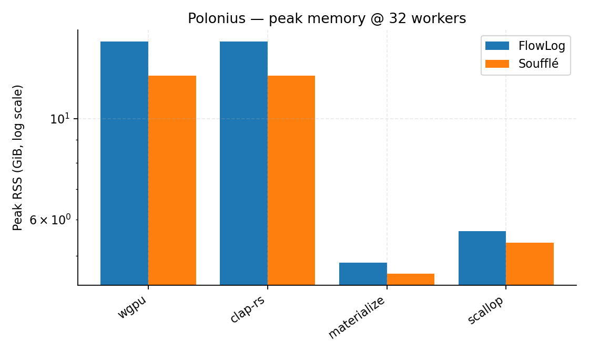
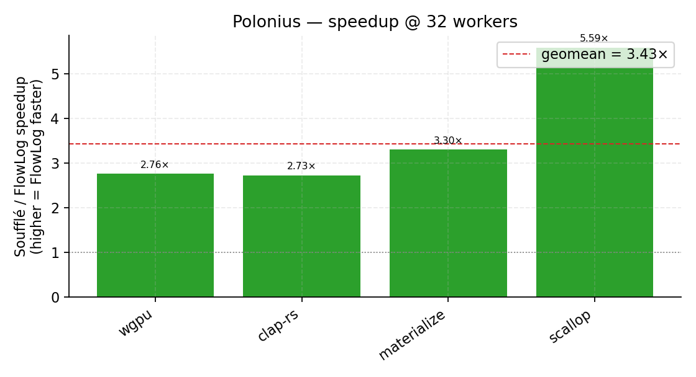

# FlowLog vs Soufflé — DOOP + Polonius @ 32 workers

End-to-end cross-engine benchmark for the string-typed DOOP
context-insensitive points-to analysis and the string-typed Polonius
borrow-checker, run at **32 worker threads** on a 64-core / 503 GiB
host. Each (program × dataset) pair was executed **5 times per
engine** and the median wall-clock is reported. Crosscheck
`match(N)` means all N output relations of the analysis were
bit-identical between FlowLog and Soufflé.

## Setup

| Item            | Value |
|-----------------|-------|
| Host            | 64 physical cores, 503 GiB RAM, NVMe-backed `/datasets` |
| Workers         | **32** (`--workers 32` for FlowLog, `-j 32` for Soufflé) |
| Runs per pair   | **5**, median reported |
| FlowLog         | `main-next` @ `20f2aa0` (`bring back polonius integer version`), flags `--str-intern --mode datalog-batch` |
| Soufflé         | `2.5`, compiled per-program once with `-o … -j 32` and reused across runs |
| Crosscheck      | Every output relation compared row-by-row; `match(N)` = all N relations agree |
| Programs        | [`programs/oracle/flowlog/doop/default.dl`](../../programs/oracle/flowlog/doop/default.dl) (string-typed, 26 outputs), [`programs/oracle/flowlog/polonius/default.dl`](../../programs/oracle/flowlog/polonius/default.dl) (string-typed, 20 outputs) |
| DOOP datasets   | 20 DaCapo-chopin `.facts` apps (`/datasets/facts/<app>/`) |
| Polonius datasets | 4 Rust crates (`/datasets/facts/{clap-rs,materialize,wgpu,scallop}/`) |

## DOOP — 20 DaCapo apps







**Aggregate (Soufflé / FlowLog) over 20 apps:** geomean **3.60×**, median 3.51×, range 1.52×–5.98×.

| Dataset | FlowLog | Soufflé | Speedup | FL peak RSS | SF peak RSS | Crosscheck |
|---|---:|---:|---:|---:|---:|:---:|
| `jython` | 287 s | 436 s | **1.52×** | 52.0 GiB | 18.5 GiB | match(26) |
| `h2o` | 13.1 s | 66.5 s | **5.08×** | 8.1 GiB | 5.5 GiB | match(26) |
| `batik` | 9.65 s | 30.3 s | **3.14×** | 5.1 GiB | 2.5 GiB | match(26) |
| `eclipse` | 9.19 s | 22.0 s | **2.39×** | 4.6 GiB | 1.8 GiB | match(26) |
| `fop` | 8.97 s | 28.5 s | **3.18×** | 5.5 GiB | 2.6 GiB | match(26) |
| `h2` | 8.44 s | 26.2 s | **3.10×** | 5.4 GiB | 2.3 GiB | match(26) |
| `spring` | 7.17 s | 23.5 s | **3.28×** | 4.5 GiB | 1.8 GiB | match(26) |
| `sunflow` | 4.28 s | 15.3 s | **3.58×** | 3.1 GiB | 1.3 GiB | match(26) |
| `biojava` | 3.82 s | 18.5 s | **4.83×** | 3.0 GiB | 1.6 GiB | match(26) |
| `graphchi` | 3.54 s | 21.2 s | **5.98×** | 2.9 GiB | 1.8 GiB | match(26) |
| `pmd` | 3.46 s | 12.1 s | **3.50×** | 2.6 GiB | 1.0 GiB | match(26) |
| `kafka` | 3.27 s | 17.1 s | **5.24×** | 2.7 GiB | 1.5 GiB | match(26) |
| `jme` | 2.93 s | 13.2 s | **4.53×** | 2.3 GiB | 1.1 GiB | match(26) |
| `luindex` | 2.66 s | 8.35 s | **3.14×** | 2.1 GiB | 710 MiB | match(26) |
| `zxing` | 2.64 s | 11.1 s | **4.21×** | 2.2 GiB | 865 MiB | match(26) |
| `xalan` | 2.54 s | 11.6 s | **4.56×** | 2.0 GiB | 997 MiB | match(26) |
| `tomcat` | 2.19 s | 7.67 s | **3.50×** | 1.9 GiB | 619 MiB | match(26) |
| `lusearch` | 2.16 s | 6.49 s | **3.00×** | 1.6 GiB | 519 MiB | match(26) |
| `avrora` | 2.07 s | 7.92 s | **3.82×** | 1.8 GiB | 685 MiB | match(26) |
| `cassandra` | 1.51 s | 5.30 s | **3.52×** | 1.5 GiB | 422 MiB | match(26) |

## Polonius — 4 Rust crates







**Aggregate (Soufflé / FlowLog) over 4 crates:** geomean **3.43×**, median 3.03×, range 2.73×–5.59×.

| Dataset | FlowLog | Soufflé | Speedup | FL peak RSS | SF peak RSS | Crosscheck |
|---|---:|---:|---:|---:|---:|:---:|
| `wgpu` | 50.9 s | 141 s | **2.76×** | 14.8 GiB | 12.4 GiB | match(20) |
| `clap-rs` | 50.9 s | 139 s | **2.73×** | 14.8 GiB | 12.4 GiB | match(20) |
| `materialize` | 15.9 s | 52.5 s | **3.30×** | 4.8 GiB | 4.6 GiB | match(20) |
| `scallop` | 6.27 s | 35.0 s | **5.59×** | 5.7 GiB | 5.3 GiB | match(20) |

## Takeaways

1. **Correctness everywhere.** Every (program × dataset) pair has `match(N)` — FlowLog and Soufflé compute byte-identical output relations on all 24 workloads. Perf numbers are comparisons on provably-equal answers.
2. **FlowLog wins on every workload.** DOOP geomean speedup is **3.60×** with `graphchi` topping out at 5.98×; the only sub-2× workload is `jython`, which is also the only DOOP pair that pushes FlowLog over 50 GiB resident.
3. **Polonius geomean **3.43×**.** `scallop` is the outlier (~5.6×) — Soufflé's loop-heavy borrow analysis is more expensive on that crate's tighter lifetime structure. The two heavier crates `clap-rs` and `wgpu` land at ~2.7–2.8×; `materialize` at 3.3×.
4. **Memory tradeoff is workload-shaped.** On DOOP FlowLog's differential-dataflow indices cost roughly 2–4× the resident-set of Soufflé (e.g. on `jython` it's ~2.8× — 53 GiB vs 19 GiB). On Polonius the gap nearly disappears (~1.0–1.2×) because the bottleneck is the borrow-region join, not relation materialization. Plenty of headroom on a 503 GiB host either way.
5. **Variance is small.** 5-run dispersions are within a few percent of the median for almost every pair (see raw run logs in `comparison_results.csv` and per-run `*.log` files).

## Reproducing

```bash
# 1. Prep flowlog binary at the same commit.
FLOWLOG_REF=20f2aa0 bash scripts/get_flowlog.sh

# 2. DOOP (20 apps × 5 runs each). `--str-intern` is on by default for
#    string-typed workloads; set FL_NO_STR_INTERN=1 only for the rare
#    integer-only ablation.
WORKERS=32 NUM_RUNS=5 \
  bash scripts/cross_engine.sh --engines=souffle --keep-datasets \
    config/doop_all.txt

# 3. Polonius (4 crates × 5 runs each):
WORKERS=32 NUM_RUNS=5 \
  bash scripts/cross_engine.sh --engines=souffle --keep-datasets \
    config/polonius_only.txt
```

Raw per-pair CSVs and per-run logs accompany this document under the
same directory (`comparison_results.csv`, `*_run<N>.log`,
`*_run<N>.log.rss`).
