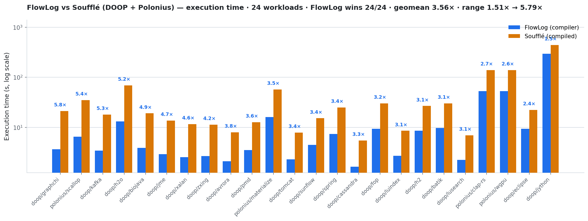
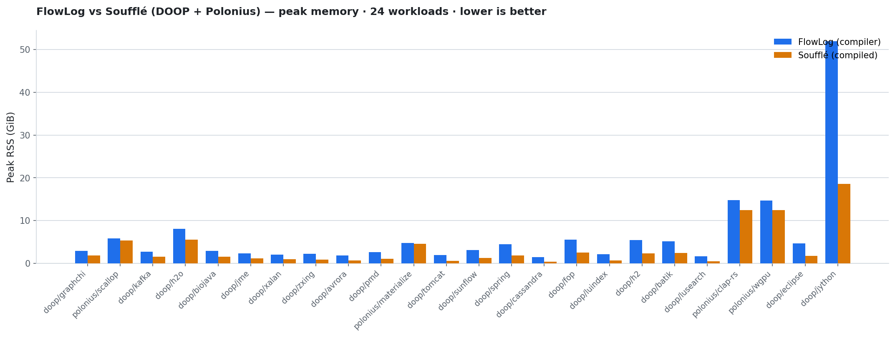
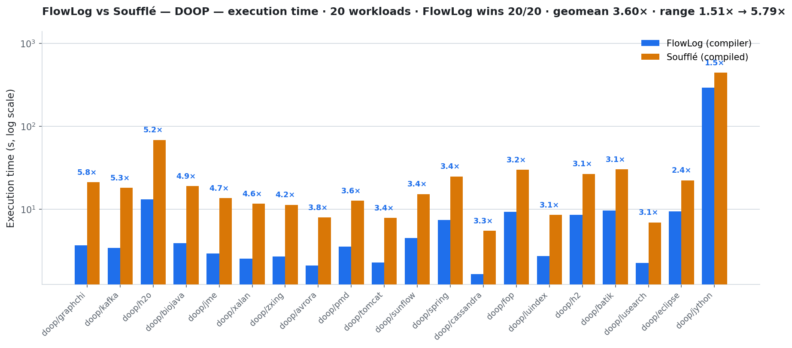
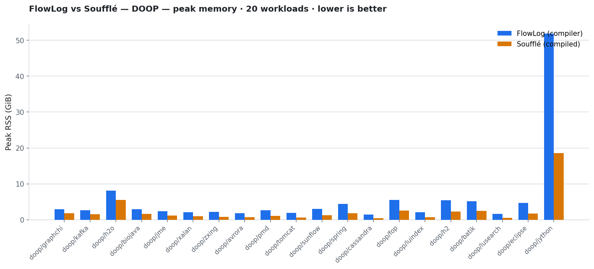
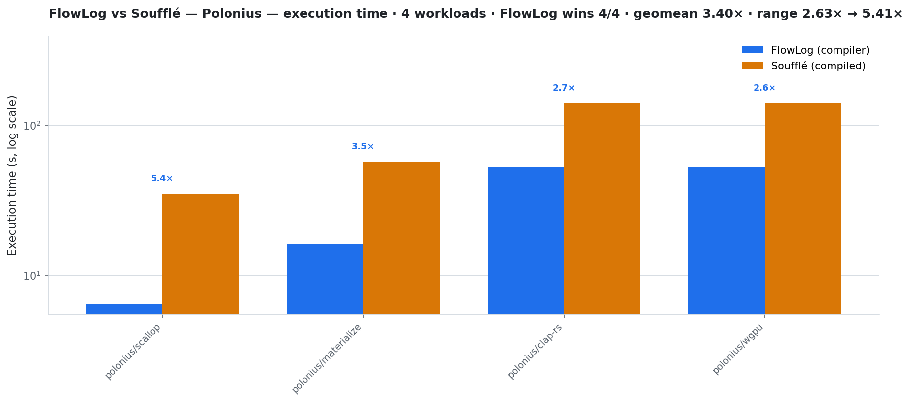
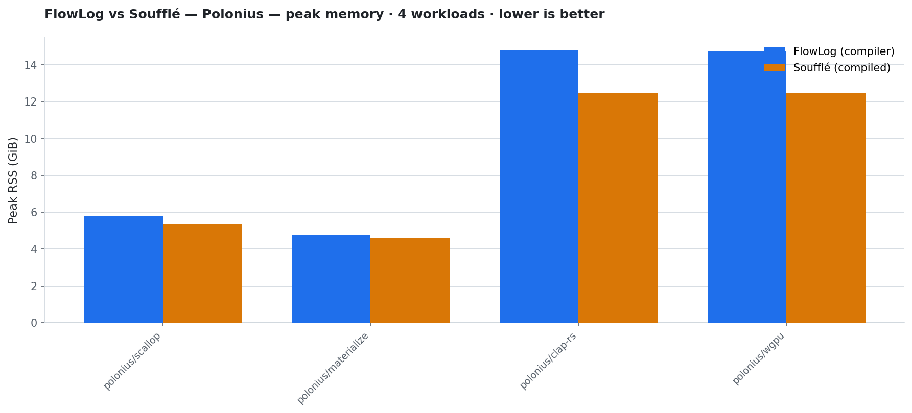

# `[west 1]` FlowLog vs Soufflé — DOOP + Polonius @ 32 threads

End-to-end cross-engine benchmark of the **string-typed DOOP**
context-insensitive points-to analysis (20 DaCapo apps, 26 outputs)
and the **string-typed Polonius** borrow checker (4 Rust crates, 20
outputs), run at **32 worker threads** on the `flowlog-west` host.
Each (program × dataset) pair was executed **5 times per engine** and
the **median** wall-clock is reported.

All 24 pairs cross-check **bit-for-bit** against Soufflé:
**`match(26)`** on every DOOP app, **`match(20)`** on every Polonius
crate.

## TL;DR

| Suite | N | FlowLog wins | Geomean speedup | Median | Range |
|---|---:|---:|---:|---:|---|
| DOOP    | 20 | **20/20** | **3.60×** | 3.41× | 1.51× (`jython`) → 5.79× (`graphchi`) |
| Polonius |  4 | **4/4**   | **3.40×** | 3.09× | 2.63× (`wgpu`)   → 5.41× (`scallop`)  |
| **All** | 24 | **24/24** | **3.56×** | 3.41× | 1.51× → 5.79× |

Speedup = Soufflé total / FlowLog exec; higher is better for FlowLog.

## Setup

| Item | Value |
|---|---|
| Host             | `flowlog-west`, 64 physical cores, 503 GiB RAM, NVMe-backed `/datasets` |
| Workers          | **32** (`-w 32` for FlowLog, `-j 32` at Soufflé compile **and** run) |
| Runs per pair    | **5** per engine; median reported |
| FlowLog          | `main-next` @ `20f2aa0`, flags `--str-intern --mode datalog-batch` |
| Soufflé          | `2.5`, compiled per-program once with `-o … -j 32` and reused across runs |
| Crosscheck       | Every output relation compared row-by-row; `match(N)` = all N relations agree |
| DOOP programs    | [`programs/oracle/flowlog/doop/default.dl`](../../../programs/oracle/flowlog/doop/default.dl) vs [`programs/oracle/souffle/doop.dl`](../../../programs/oracle/souffle/doop.dl) — both string-typed, 26 output relations |
| Polonius programs| [`programs/oracle/flowlog/polonius/default.dl`](../../../programs/oracle/flowlog/polonius/default.dl) vs [`programs/oracle/souffle/polonius.dl`](../../../programs/oracle/souffle/polonius.dl) → `borrow_str.dl` — both string-typed, 20 output relations |
| DOOP datasets    | 20 DaCapo 23.11-MR2-chopin apps, `/datasets/facts/<app>/` |
| Polonius datasets| 4 Rust crates: `{clap-rs, materialize, wgpu, scallop}` |

## Plots — all 24 workloads





## DOOP — 20 DaCapo apps





| Dataset | FlowLog | Soufflé | Speedup | FL peak RSS | SF peak RSS | Crosscheck |
|---|---:|---:|---:|---:|---:|:---:|
| `graphchi` | 3.65 s | 21.1 s | **5.79×** | 2.92 GiB | 1.82 GiB | match(26) |
| `kafka` | 3.43 s | 18.1 s | **5.27×** | 2.69 GiB | 1.53 GiB | match(26) |
| `h2o` | 13.1 s | 68.6 s | **5.23×** | 8.10 GiB | 5.51 GiB | match(26) |
| `biojava` | 3.91 s | 19.0 s | **4.87×** | 2.95 GiB | 1.59 GiB | match(26) |
| `jme` | 2.92 s | 13.6 s | **4.66×** | 2.36 GiB | 1.13 GiB | match(26) |
| `xalan` | 2.53 s | 11.7 s | **4.61×** | 2.08 GiB | 995 MiB | match(26) |
| `zxing` | 2.69 s | 11.3 s | **4.20×** | 2.19 GiB | 863 MiB | match(26) |
| `avrora` | 2.10 s | 7.94 s | **3.78×** | 1.84 GiB | 684 MiB | match(26) |
| `pmd` | 3.54 s | 12.7 s | **3.58×** | 2.66 GiB | 1.03 GiB | match(26) |
| `tomcat` | 2.29 s | 7.83 s | **3.42×** | 1.93 GiB | 619 MiB | match(26) |
| `sunflow` | 4.47 s | 15.2 s | **3.40×** | 3.06 GiB | 1.25 GiB | match(26) |
| `spring` | 7.38 s | 24.9 s | **3.37×** | 4.45 GiB | 1.79 GiB | match(26) |
| `cassandra` | 1.65 s | 5.48 s | **3.33×** | 1.49 GiB | 420 MiB | match(26) |
| `fop` | 9.34 s | 29.9 s | **3.21×** | 5.51 GiB | 2.56 GiB | match(26) |
| `luindex` | 2.72 s | 8.53 s | **3.13×** | 2.09 GiB | 711 MiB | match(26) |
| `h2` | 8.56 s | 26.7 s | **3.12×** | 5.41 GiB | 2.29 GiB | match(26) |
| `batik` | 9.69 s | 30.2 s | **3.12×** | 5.10 GiB | 2.46 GiB | match(26) |
| `lusearch` | 2.25 s | 6.92 s | **3.08×** | 1.65 GiB | 520 MiB | match(26) |
| `eclipse` | 9.40 s | 22.3 s | **2.38×** | 4.67 GiB | 1.76 GiB | match(26) |
| `jython` | 293 s  | 442 s  | **1.51×** | 51.91 GiB | 18.58 GiB | match(26) |

## Polonius — 4 Rust crates





| Dataset | FlowLog | Soufflé | Speedup | FL peak RSS | SF peak RSS | Crosscheck |
|---|---:|---:|---:|---:|---:|:---:|
| `scallop`     | 6.47 s | 35.1 s | **5.41×** |  5.81 GiB |  5.33 GiB | match(20) |
| `materialize` | 16.2 s | 56.9 s | **3.52×** |  4.77 GiB |  4.57 GiB | match(20) |
| `clap-rs`     | 52.6 s | 139 s  | **2.65×** | 14.75 GiB | 12.43 GiB | match(20) |
| `wgpu`        | 52.9 s | 139 s  | **2.63×** | 14.72 GiB | 12.43 GiB | match(20) |

## Memory trade-off

FlowLog trades memory for speed — peak RSS is **2.4× higher** than
Soufflé on DOOP (geomean) but roughly **at parity on Polonius** (1.12×
geomean). On the smallest DOOP apps Soufflé peaks at ~0.5–1 GiB while
FlowLog peaks at ~1.5–2 GiB; on the heaviest (`jython`) the ratio
inverts in absolute terms — both engines need tens of GiB and FlowLog
sits ~3× above Soufflé (52 GiB vs 19 GiB).

## Reproducing

```bash
# In flowlog-bench:
WORKERS=32 NUM_RUNS=5 FLOWLOG_REF=20f2aa0 KEEP_DATASETS=1 \
  bash scripts/cross_engine.sh --engines=souffle --keep-datasets --fresh \
    config/west1.txt
```

The raw 21-column sweep CSV is at
[`data/all_comparison.csv`](./data/all_comparison.csv); per-suite
slices live at [`data/doop_comparison.csv`](./data/doop_comparison.csv)
and [`data/polonius_comparison.csv`](./data/polonius_comparison.csv).
Plots are regenerated from those CSVs by the per-suite plot calls in
this run's branch.

Notes:

- `--str-intern` is **on by default** for FlowLog compiles since
  `scripts/engines/compiler.sh@ba5b104`; the flag is appropriate for
  these string-typed workloads and the runner records it in the build
  log (`<stem>_<dataset>_compiler_build.log`).
- Soufflé runs in **compiled** mode (`souffle -o … -j 32` + binary
  invoked with `-j 32`); per `scripts/engines/souffle.sh`, this is the
  only Soufflé configuration that actually parallelises via libgomp.
- `KEEP_DATASETS=1` is required on this host because `facts/` is a
  symlink to `/datasets/facts` — the runner refuses to `rm -rf`
  through a symlink as a safety net.
